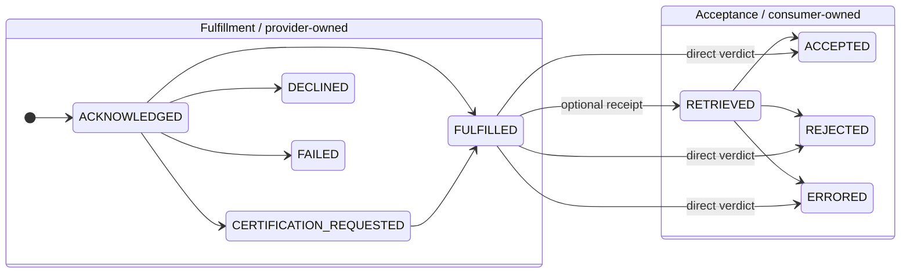
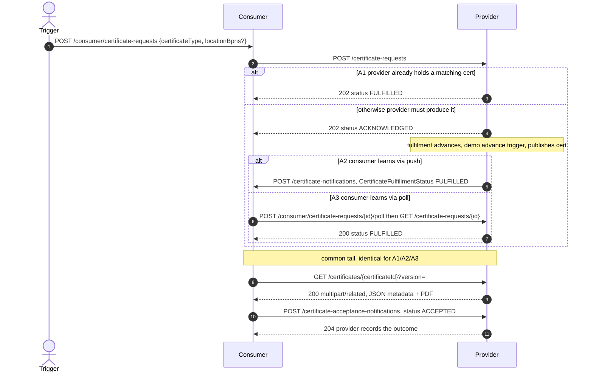
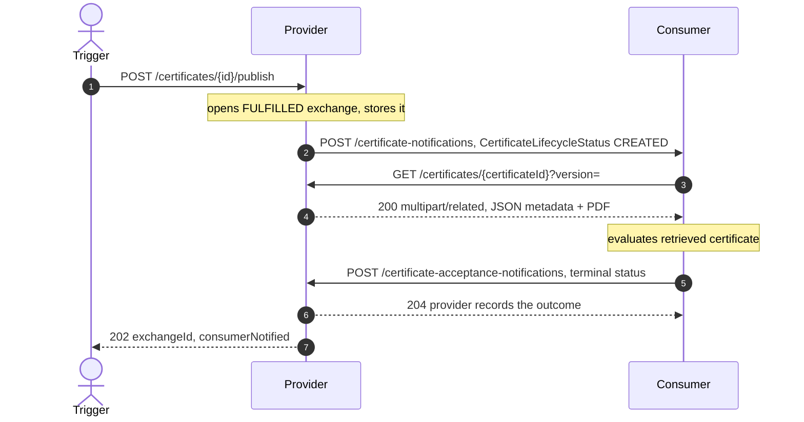
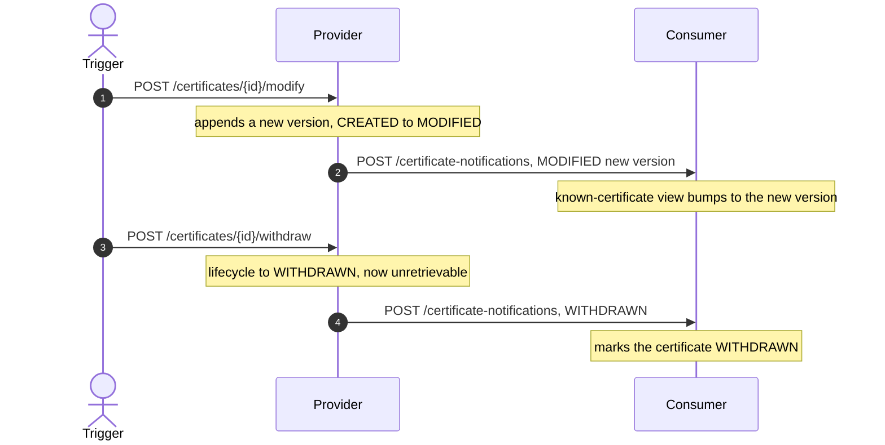
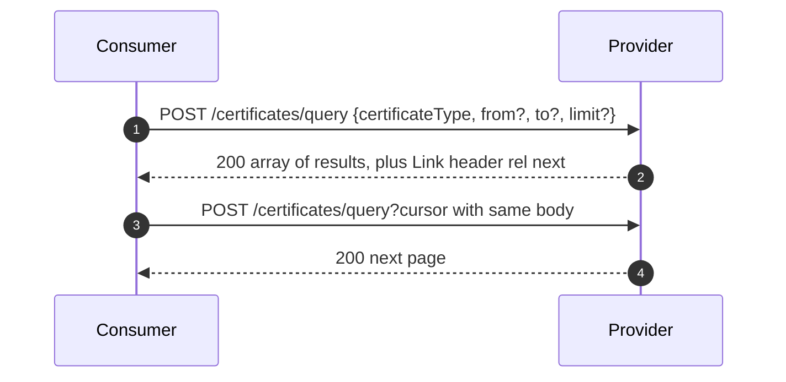

# Certo — Supported Flows

This document describes the interaction flows Certo implements from the **CX-0135 Company Certificate
Management (CCM)** data-plane wire protocol, and **ties each flow to the tests that cover it** so they
can be correlated. See the [README](../README.md) for build/run + curl examples and [`docs/ccm/`](ccm)
for the vendored spec.

**Test-class legend** (used in every "Tests" line and in the [traceability matrix](#traceability-matrix)):

| Code | Test class | Style |
|------|------------|-------|
| **[provider]** | `ProviderCertificateApiTest` | provider endpoints via MockMvc |
| **[consumer]** | `ConsumerCertificateApiTest` | consumer end-to-end vs a real server (port 18080) |
| **[poll]** | `ConsumerPollFlowTest` | consumer poll path, unreachable push (port 18081) |
| **[callback]** | `ProviderAcceptanceClientTest` | acceptance-callback shape via MockWebServer |

## The model

Every flow derives from two independent state machines (CX-0135 §2):

- A **Certificate Exchange** (correlated by `exchangeId`) — one delivery interaction: a provider-owned
  **Fulfillment** phase, then a consumer-owned **Acceptance** phase.
- A **Certificate Lifecycle** — the artifact over time (`CREATED → MODIFIED* → WITHDRAWN`), keyed by
  `certificateId` + `version`, independent of any exchange.

> **`RETRIEVED` is optional** (CX-0135 §2.1.3): an exchange may report it as a delivery receipt, or
> transition straight from `FULFILLED` to a terminal verdict. Certo's consumer takes the direct path —
> one acceptance callback rather than a separate receipt first.

> **Decoupling:** both roles run in one process, but the provider never auto-calls the consumer (or
> vice versa) — that wiring is the DSP control plane, which is out of scope. Each flow is driven by
> calling the relevant endpoints; cross-role calls are real OkHttp calls against the hardcoded
> `certo.provider-base-url` / `certo.consumer-base-url`.

## Flow index

| Flow | What | Variants |
|------|------|----------|
| **A** | Consumer-initiated **pull** | A1 held/immediate · A2 async+push · A3 async+poll · A4 declined · A5 failed |
| **B** | Provider-initiated **push** (lifecycle `CREATED`) | B1 accepted · B2 rejected (expired) · B3 errored |
| **C** | Certificate **lifecycle** (`MODIFIED` / `WITHDRAWN`) | C1 modify · C2 withdraw · C3 end-to-end |
| **D** | **Query** / discovery | D1 by type · D2 pagination |
| **E** | **Cross-cutting** protocol rules (state machine, CloudEvents, retrieval, batch, idempotency) | — |

---

## Flow A — Consumer-initiated pull

The consumer opens its **own** request, the certificate becomes available (immediately if held, else
asynchronously), then the consumer retrieves it and reports acceptance. Driven by the demo trigger
`POST /consumer/certificate-requests`.

The `alt` boxes below are **mutually-exclusive paths** (like `if`/`else`) — exactly one branch runs per
request. They differ *only* in how the consumer reaches `FULFILLED`; the retrieve + accept tail after the
boxes is identical for all three variants:

- **A1** — the provider already holds a matching certificate → `FULFILLED` in the request response.
- **A2 / A3** — nothing held, so the provider answers `ACKNOWLEDGED` and produces it asynchronously; the
  consumer then learns it is `FULFILLED` either by a **push** (A2) or by **polling** (A3).

1. **Open** — the consumer calls the provider's `POST /certificate-requests`; the provider assigns
   `exchangeId`/`certificateId`/`version` (`HTTP 202`) and records a consumer-side exchange.
2. **Become available** — for an offered type: if a held certificate covers the requested
   `locationBpns` the provider returns `FULFILLED` at once; otherwise `ACKNOWLEDGED`, then it fulfils
   asynchronously (`ACKNOWLEDGED → CERTIFICATION_REQUESTED → FULFILLED`, or `FAILED`), publishing the
   certificate at `FULFILLED`. The consumer learns it's `FULFILLED` by **push** or **poll**.
3. **Retrieve** — `GET /certificates/{id}?version=` → `multipart/related` (JSON + PDF), available only
   once `FULFILLED`.
4. **Report acceptance** — the consumer POSTs a terminal `ACCEPTED`/`REJECTED`/`ERRORED` directly
   (`RETRIEVED` is optional and skipped); the provider records it.

**Variants & tests**

| # | Variant | Tests |
|---|---------|-------|
| **A1** | Held cert → immediate `FULFILLED` → accepted | `consumerInitiatedPull_heldCertificate_fulfilledImmediatelyAndAccepted` **[consumer]**; `requestOfferedType_fulfilledImmediately_andPollable` **[provider]** |
| **A2** | Async fulfilment learned via **push** | `consumerInitiatedPull_pushOnFulfillment_retrievesAndAccepts`, `fulfillmentNotification_accepted` **[consumer]**; `request_notHeld_acknowledgesThenFulfillsAsynchronously` **[provider]** |
| **A3** | Async fulfilment learned via **poll** | `consumerInitiatedPull_pollForFulfillment_retrievesAndAccepts` **[poll]** |
| **A4** | Unoffered type → `DECLINED` | `consumerInitiatedPull_unofferedType_declined` **[consumer]**; `requestUnofferedType_declinedWithErrors`, `requestMissingType_badRequest` **[provider]** |
| **A5** | Fulfilment `FAILED` (sentinel `BPNFAIL`) | `consumerInitiatedPull_failedFulfillment_recordsFailedNoAcceptance` **[consumer]**; `request_failTrigger_endsInFailed` **[provider]** |

Provider-endpoint coverage for the steps: poll/`404` `requestStatus_unknownExchange_notFound` **[provider]**;
retrieve `retrieveCertificate_returnsMultipartWithMetadataAndPdf`, `…_specificVersion`,
`…_unknown_notFound` **[provider]**; acceptance recording + error rules
`acceptanceNotification_recordsStatus_thenUnknownIs404_andRejectedNeedsErrors` **[provider]**; acceptance
callback shape `reportsAcceptedAsCloudEvent`, `reportsRejectedWithErrors`, `deliveryFailureIsSwallowed`
**[callback]**; acceptance-status `404` `acceptanceStatus_unknownExchange_notFound` **[consumer]**.

---

## Flow B — Provider-initiated push (lifecycle CREATED)

The provider publishes a held certificate: it opens+stores a `FULFILLED` exchange and pushes a
`CertificateLifecycleStatus` `CREATED` event. The consumer retrieves, evaluates, and reports back,
which the provider records — the whole loop from one publish trigger.

1. **Publish** — `POST /certificates/{id}/publish` opens+stores a `FULFILLED` exchange and pushes the
   `CREATED` event. Only `CREATED` opens an exchange.
2. **Retrieve + evaluate** — the consumer retrieves the certificate and decides.
3. **Report back** — the consumer reports the terminal status directly (`RETRIEVED` optional, skipped);
   the provider records it (it owns the exchange). Inspect via `GET /certificate-acceptance-status/{id}` (consumer) and
   `GET /certificate-exchanges/{id}` (provider).

**Variants & tests**

| # | Variant | Tests |
|---|---------|-------|
| **B1** | Valid cert → `ACCEPTED` (full loop) | `providerInitiatedPush_closesLoopBackToProvider`, `createdLifecycleEvent_retrievesValidCertificate_andAccepts` **[consumer]** |
| **B2** | Expired cert → `REJECTED` | `createdLifecycleEvent_retrievesExpiredCertificate_andRejects` **[consumer]** |
| **B3** | Unretrievable → `ERRORED` | `createdLifecycleEvent_unknownCertificate_isErrored` **[consumer]** |

---

## Flow C — Certificate lifecycle (MODIFIED / WITHDRAWN)

The provider revises a certificate and notifies the consumer, which keeps a synchronized view. These
transitions do **not** open an exchange (§2.2.4).

1. **Modify** — `POST /certificates/{id}/modify` appends a new `version` (`CREATED → MODIFIED`, same
   fixed locations), serves it, and pushes a `MODIFIED` event.
2. **Withdraw** — `POST /certificates/{id}/withdraw` sets `WITHDRAWN`: `GET /certificates/{id}` →
   `404`, queries exclude it, a `WITHDRAWN` event is pushed, a second withdraw → `409`.
3. **Consumer reacts** — updates `GET /consumer/certificates/{id}`: `MODIFIED` bumps the known version,
   `WITHDRAWN` marks it unavailable.

**Variants & tests**

| # | Variant | Tests |
|---|---------|-------|
| **C1** | Provider modify (new version served + queried) | `modify_publishesNewVersion_servedAndQueryable` **[provider]** |
| **C2** | Provider withdraw (`404` + excluded + `409`) | `withdraw_makesUnretrievableAndExcludedFromQuery_andSecondWithdrawConflicts` **[provider]** |
| **C3** | Consumer reacts (`MODIFIED`/`WITHDRAWN`) | `lifecycleModified_updatesConsumerKnownCertificate`, `lifecycleWithdrawn_marksConsumerKnownCertificateUnavailable`, `lifecycle_endToEnd_modifyThenWithdraw_consumerReacts` **[consumer]** |

---

## Flow D — Query / discovery

1. **Query** — returns the latest version of each matching certificate (filtered by optional
   `validFrom ≥ from` / `validUntil ≤ to`; `WITHDRAWN` excluded). A query alone does **not** establish
   an exchange (so it doesn't permit acceptance feedback, §4.4.4).
2. **Paginate** — when more remain, an RFC 8288 `Link` header carries `next`/`prev` (`first`/`last`
   too) with opaque cursors; re-POST the same body against the linked URL.

**Variants & tests**

| # | Variant | Tests |
|---|---------|-------|
| **D1** | Query by type → latest version | `query_byType_returnsLatestVersion` **[provider]** |
| **D2** | Cursor pagination + Link relations | `query_paginates_withNextFirstLastLinks` **[provider]** |

---

## Flow E — Cross-cutting protocol rules

Not a sequence flow — rules that apply across A–D, each with its covering tests.

| # | Rule | Behavior | Tests |
|---|------|----------|-------|
| **E1** | **CloudEvents envelope** | Required `specversion`=="1.0", `type`, `source`, `id`, `sourcebpn` → else `400` | `acceptanceEvent_missingSourcebpn_isBadRequest`, `acceptanceEvent_invalidEnvelope_isBadRequest` **[provider]**; `unsupportedEventType_badRequest` **[consumer]** |
| **E2** | **Idempotency** | Duplicate `source`+`id` ignored (both sides) | `acceptanceEvent_duplicateIsIgnored` **[provider]**; `duplicateLifecycleEvent_isIgnored` **[consumer]** |
| **E3** | **Batch atomicity** | Validate all before applying; one bad event applies none | `acceptanceBatch_isAtomic_oneBadEventAppliesNone` **[provider]**; `notificationBatch_isAtomic_oneBadEventAppliesNone`, `batchOfEvents_accepted` **[consumer]** |
| **E4** | **State machine** | Illegal transitions, terminal immutability, acceptance-before-`FULFILLED` → `409` | `acceptance_beforeFulfilled_isConflict`, `acceptance_afterTerminal_isConflict` **[provider]** |
| **E7** | **Optional `RETRIEVED`** | Terminal verdict accepted directly from `FULFILLED`; the optional `RETRIEVED` receipt still valid | `acceptanceNotification_directTerminalWithoutRetrieved_isRecorded`, `acceptanceNotification_optionalRetrievedThenTerminal_isRecorded` **[provider]** |
| **E5** | **Re-attempt = new exchange** | Each request opens a distinct `exchangeId` | `reattempt_opensADistinctExchange` **[provider]** |
| **E6** | **Retrieval content negotiation** | `Accept` honoured (`406` if `multipart/related` excluded); RFC 2387 `Content-ID`/`start`; JSON error even with `Accept: multipart/related` | `retrieveCertificate_multipartAccept_ok_butIncompatibleAccept_is406`, `retrieveCertificate_unknown_withMultipartAccept_stillNotFound`, `retrieveCertificate_returnsMultipartWithMetadataAndPdf` **[provider]** |

---

## Traceability matrix

Every flow/variant ↔ its tests (legend above). All 47 tests are accounted for.

| Flow | Test(s) |
|------|---------|
| **A1** held/immediate | `consumerInitiatedPull_heldCertificate_fulfilledImmediatelyAndAccepted` **[consumer]**, `requestOfferedType_fulfilledImmediately_andPollable` **[provider]** |
| **A2** async + push | `consumerInitiatedPull_pushOnFulfillment_retrievesAndAccepts` **[consumer]**, `fulfillmentNotification_accepted` **[consumer]**, `request_notHeld_acknowledgesThenFulfillsAsynchronously` **[provider]** |
| **A3** async + poll | `consumerInitiatedPull_pollForFulfillment_retrievesAndAccepts` **[poll]** |
| **A4** declined | `consumerInitiatedPull_unofferedType_declined` **[consumer]**, `requestUnofferedType_declinedWithErrors` **[provider]**, `requestMissingType_badRequest` **[provider]** |
| **A5** failed | `consumerInitiatedPull_failedFulfillment_recordsFailedNoAcceptance` **[consumer]**, `request_failTrigger_endsInFailed` **[provider]** |
| **A** steps (poll/retrieve/accept) | `requestStatus_unknownExchange_notFound`, `retrieveCertificate_returnsMultipartWithMetadataAndPdf`, `retrieveCertificate_specificVersion`, `retrieveCertificate_unknown_notFound`, `acceptanceNotification_recordsStatus_thenUnknownIs404_andRejectedNeedsErrors` **[provider]**; `acceptanceStatus_unknownExchange_notFound` **[consumer]**; `reportsAcceptedAsCloudEvent`, `reportsRejectedWithErrors`, `deliveryFailureIsSwallowed` **[callback]** |
| **B1** push → accepted | `providerInitiatedPush_closesLoopBackToProvider`, `createdLifecycleEvent_retrievesValidCertificate_andAccepts` **[consumer]** |
| **B2** push → rejected | `createdLifecycleEvent_retrievesExpiredCertificate_andRejects` **[consumer]** |
| **B3** push → errored | `createdLifecycleEvent_unknownCertificate_isErrored` **[consumer]** |
| **C1** modify | `modify_publishesNewVersion_servedAndQueryable` **[provider]** |
| **C2** withdraw | `withdraw_makesUnretrievableAndExcludedFromQuery_andSecondWithdrawConflicts` **[provider]** |
| **C3** consumer reacts | `lifecycleModified_updatesConsumerKnownCertificate`, `lifecycleWithdrawn_marksConsumerKnownCertificateUnavailable`, `lifecycle_endToEnd_modifyThenWithdraw_consumerReacts` **[consumer]** |
| **D1** query | `query_byType_returnsLatestVersion` **[provider]** |
| **D2** pagination | `query_paginates_withNextFirstLastLinks` **[provider]** |
| **E1** envelope | `acceptanceEvent_missingSourcebpn_isBadRequest`, `acceptanceEvent_invalidEnvelope_isBadRequest` **[provider]**, `unsupportedEventType_badRequest` **[consumer]** |
| **E2** idempotency | `acceptanceEvent_duplicateIsIgnored` **[provider]**, `duplicateLifecycleEvent_isIgnored` **[consumer]** |
| **E3** batch atomicity | `acceptanceBatch_isAtomic_oneBadEventAppliesNone` **[provider]**, `notificationBatch_isAtomic_oneBadEventAppliesNone` **[consumer]**, `batchOfEvents_accepted` **[consumer]** |
| **E4** state machine | `acceptance_beforeFulfilled_isConflict`, `acceptance_afterTerminal_isConflict` **[provider]** |
| **E5** re-attempt | `reattempt_opensADistinctExchange` **[provider]** |
| **E6** retrieval negotiation | `retrieveCertificate_multipartAccept_ok_butIncompatibleAccept_is406`, `retrieveCertificate_unknown_withMultipartAccept_stillNotFound` **[provider]** |
| **E7** optional `RETRIEVED` | `acceptanceNotification_directTerminalWithoutRetrieved_isRecorded`, `acceptanceNotification_optionalRetrievedThenTerminal_isRecorded` **[provider]** |
| _infra_ | `contextLoads` **[CertoApplicationTest]** |

---

## Demo simplifications (not protocol limitations)

- A held certificate covering the requested locations fulfils **immediately**; otherwise the request
  is `ACKNOWLEDGED` and the provider's asynchronous fulfilment
  (`ACKNOWLEDGED → CERTIFICATION_REQUESTED → FULFILLED`, or `FAILED`) is driven by an explicit
  `POST /certificate-requests/{id}/advance` trigger rather than a timer (locations including `BPNFAIL`
  end in `FAILED`).
- On `CREATED`/`FULFILLED` the consumer genuinely retrieves over HTTP (OkHttp), evaluates synchronously,
  and reports the terminal outcome back directly (`RETRIEVED` is optional and skipped — a single
  acceptance callback); base URLs are hardcoded (`certo.provider-base-url` / `certo.consumer-base-url`,
  no DSP discovery). A fuller implementation might validate asynchronously and emit an interim
  `RETRIEVED` receipt, and MAY re-retrieve after `MODIFIED`.
- Storage is in-memory and resets on restart; certificates are seeded at startup
  (`cert-iso9001-0001` with versions 1 & 2, `cert-iso14001-0001`, expired `cert-expired-0001`).
