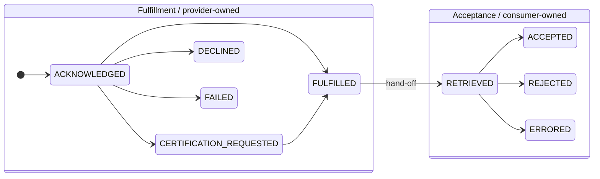
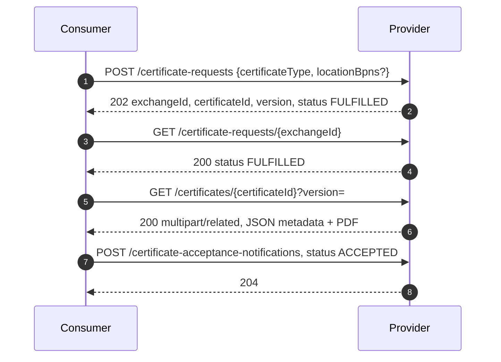
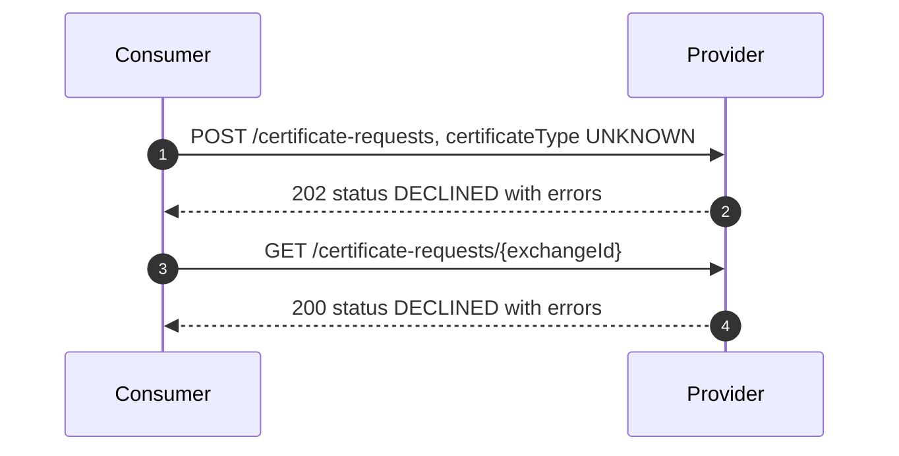
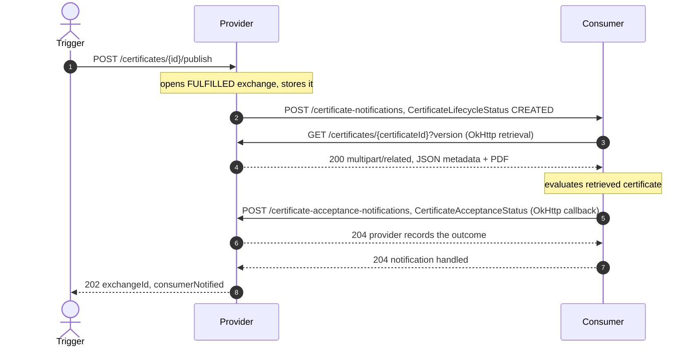
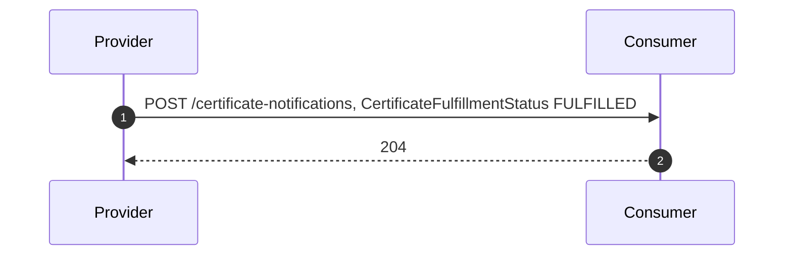
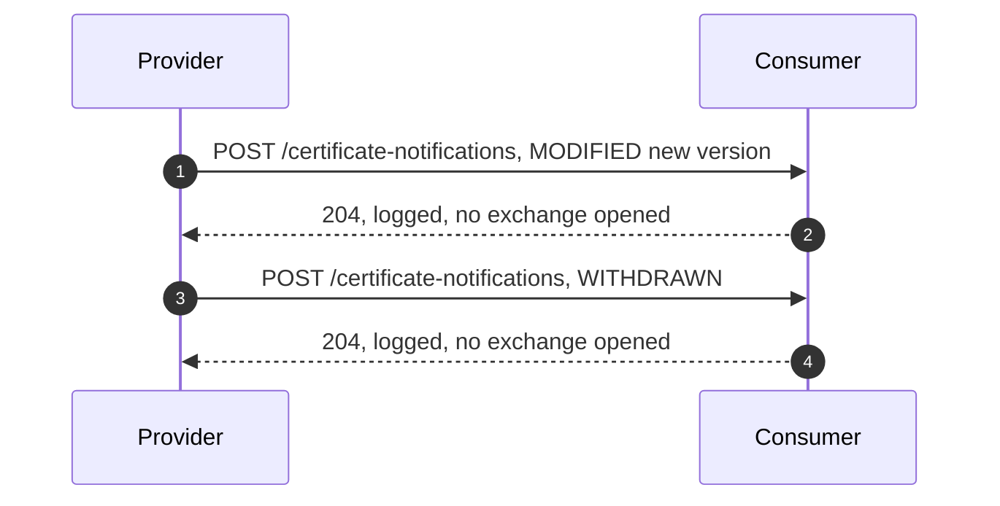
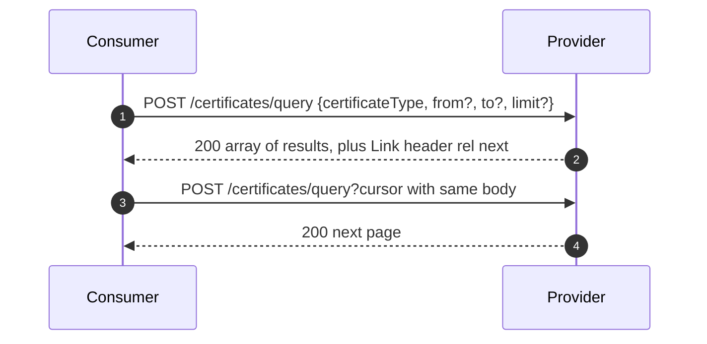

# Certo — Supported Flows

This document describes the interaction flows Certo implements from the **CX-0135 Company Certificate
Management (CCM)** data-plane wire protocol. See the [README](../README.md) for build/run and curl
examples, and [`docs/ccm/`](ccm) for the vendored specification.

## The model

Every flow derives from two independent state machines (CX-0135 §2):

- A **Certificate Exchange** (correlated by `exchangeId`) — one end-to-end delivery interaction. It runs
  through a provider-owned **Fulfillment** phase and then a consumer-owned **Acceptance** phase.
- A **Certificate Lifecycle** — the artifact itself over time (`CREATED → MODIFIED* → WITHDRAWN`), keyed
  by `certificateId` + `version`, independent of any exchange.

> **Decoupling:** both APIs run in one process, but the provider does not auto-call the consumer (or
> vice versa) — that wiring is the Dataspace Protocol (DSP) control plane, which is out of scope. Each
> flow below is driven by calling the relevant endpoints directly.

---

## Flow A — Consumer-initiated "pull" (primary happy path)

Request → poll → retrieve → accept.

1. **Request** — `POST /certificate-requests`. Opens a consumer-initiated exchange; the provider assigns
   `exchangeId`, `certificateId`, `version` and returns them (`HTTP 202`). For an **offered** type
   (`ISO9001`, `ISO14001`, `IATF16949`) the provider references an already-held certificate or produces
   one on the spot and returns `FULFILLED`.
2. **Poll fulfillment** — `GET /certificate-requests/{exchangeId}`. Reports **only** the Fulfillment
   phase. `404` if the `exchangeId` is unknown.
3. **Retrieve** — `GET /certificates/{certificateId}?version=`. Returns `multipart/related`: a JSON
   metadata part and the PDF binary. Latest version by default; `?version=N` for a specific one. `404`
   for an unknown certificate or version.
4. **Report acceptance** — `POST /certificate-acceptance-notifications` (CloudEvent
   `CertificateAcceptanceStatus`). The consumer reports `RETRIEVED`/`ACCEPTED`/`REJECTED`/`ERRORED`
   against the `exchangeId`; the provider records it. `204` on success, `404` for an unknown `exchangeId`.

### A′ — Declined request (terminal at DECLINED)

A non-offered type still returns `HTTP 202`, but with `DECLINED` and a non-empty `errors` array; an
`exchangeId`/`certificateId` are still returned so the outcome stays correlatable. A malformed request
(missing `certificateType`) returns `400`.

---

## Flow B — Provider-initiated "push" (lifecycle CREATED)

The provider publishes a held certificate: it opens the exchange (entering directly at `FULFILLED`,
no request phase) and pushes a lifecycle `CREATED` event to the consumer. The consumer retrieves,
evaluates, and reports its decision back — which the provider records, because it owns the exchange.
The whole loop runs from a single publish trigger (each call below is a real OkHttp call between the
two roles in this same runtime).

1. **Publish (provider-initiated)** — `POST /certificates/{id}/publish` (demo trigger; in production
   the provider's own business logic drives this). The provider opens and **stores** a `FULFILLED`
   exchange, then pushes a `CertificateLifecycleStatus` `CREATED` event to the consumer's
   `POST /certificate-notifications` (OkHttp against `certo.consumer-base-url`). Only `CREATED` opens an
   exchange; `204` from the consumer on success.
   **Evaluation:** the consumer retrieves the certificate from the provider
   (`GET /certificates/{certificateId}?version=` via OkHttp against `certo.provider-base-url`),
   parses the `multipart/related` metadata + PDF, and decides `ACCEPTED`, `REJECTED`
   (`"Certificate has expired"` when past `validUntil`), or `ERRORED` if it can't be retrieved.
2. **Report back (callback)** — the consumer POSTs a `CertificateAcceptanceStatus` CloudEvent to the
   provider's `POST /certificate-acceptance-notifications` (OkHttp). Because the provider opened and
   stored the exchange in step 1, it recognizes the `exchangeId` and **records the outcome** (`204`),
   closing the loop. (The callback is best-effort: if the provider didn't know the exchange it would
   reply `404`, which the consumer logs and ignores, having already recorded its decision locally.)
3. **Inspect the result** — the consumer's decision is readable at
   `GET /certificate-acceptance-status/{exchangeId}` (consumer side), and the provider's recorded view
   of both phases at `GET /certificate-exchanges/{exchangeId}` (provider side, demo/inspection).

---

## Flow C — Fulfillment-status push (poll alternative)

For a consumer-initiated exchange whose fulfillment is slow, the provider can push status instead of the
consumer polling (replaces Flow A step 2). Push and poll are equivalent and carry the same
`exchangeId`/`status`.

- `status` ∈ `ACKNOWLEDGED`, `CERTIFICATION_REQUESTED`, `FULFILLED`, `DECLINED`, `FAILED`.
- Terminal-but-not-`FULFILLED` (`DECLINED`/`FAILED`) require a non-empty `errors` array, else `400`.

---

## Flow D — Lifecycle MODIFIED / WITHDRAWN

`MODIFIED` (a new `version` published) and `WITHDRAWN` (certificate removed) are informational — they do
**not** open an exchange and produce no acceptance decision. `WITHDRAWN` may omit `validFrom`/`validUntil`.

---

## Flow E — Query / discovery

- Returns the latest version of each matching certificate (filtered by the optional
  `validFrom ≥ from` / `validUntil ≤ to` window; `WITHDRAWN` certificates excluded).
- **Cursor pagination:** when more results remain, an RFC 8288 `Link` header carries `next`/`prev`
  relations pointing back at `POST /certificates/query?cursor=…` (opaque base64 cursors). Re-issue the
  POST with the same body against the linked URL to page.
- A query/retrieve alone does **not** establish an exchange, so it does not by itself permit acceptance
  feedback (CX-0135 §4.4.4).

---

## Cross-cutting behavior

| Concern | Behavior |
|---------|----------|
| **Batch events** | Both CloudEvents endpoints accept a single event or a JSON array; a consumer batch may mix lifecycle and fulfillment events. |
| **CloudEvents binding** | Structured-mode `application/cloudevents+json` (plain `application/json` also accepted). Envelopes follow CX-0000 (`specversion`, `type`, `source`, `id`, `sourcebpn`, …). |
| **Status codes** | `202` opens a request; `204` for accepted notifications; `200` for reads/queries; `400` for malformed bodies or status/`errors` rule violations; `404` for unknown `exchangeId`/`certificateId`/version. Errors use `{ "message": … }`. |
| **Errors validation** | Acceptance: `REJECTED`/`ERRORED` require a non-empty `errors` array; `RETRIEVED`/`ACCEPTED` must not carry one. Fulfillment: `DECLINED`/`FAILED` require errors. |

## Demo simplifications (not protocol limitations)

- Offered requests fulfill **immediately** (`FULFILLED`) rather than progressing through
  `ACKNOWLEDGED → CERTIFICATION_REQUESTED`; those states exist in the model but aren't driven by a real
  async backend.
- On a `CREATED` lifecycle event the consumer genuinely retrieves the certificate over HTTP (OkHttp),
  evaluates it synchronously, and reports the outcome back to the provider via a
  `CertificateAcceptanceStatus` callback; the provider base URL is hardcoded via
  `certo.provider-base-url` (no DSP catalog/negotiation), and a fuller implementation would run the
  validation asynchronously.
- Storage is in-memory and resets on restart; certificates are seeded at startup
  (`cert-iso9001-0001` with versions 1 & 2, `cert-iso14001-0001`, and an expired `cert-expired-0001`).
