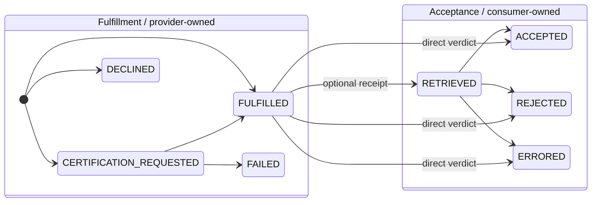
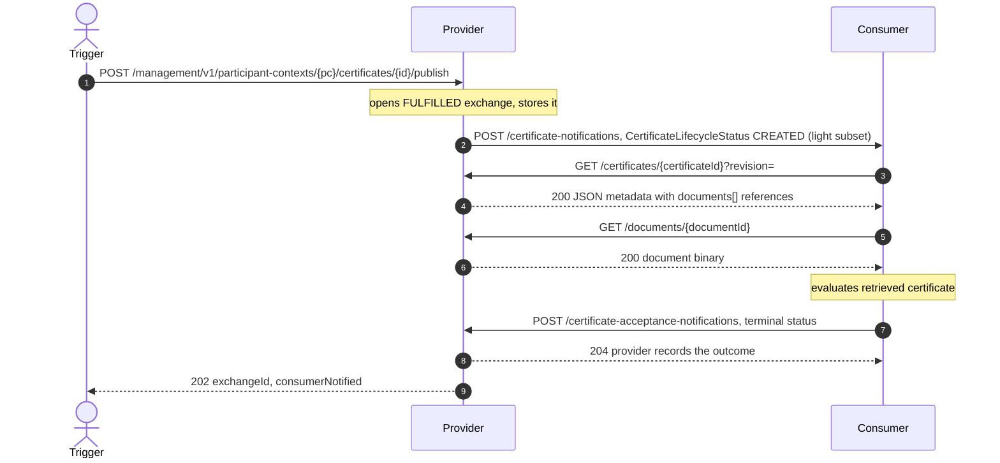
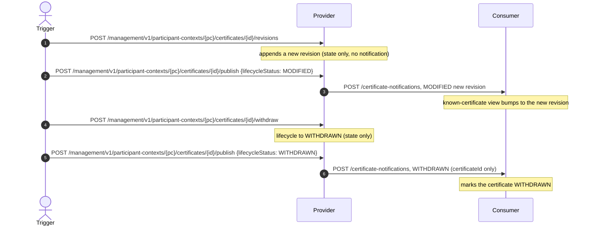
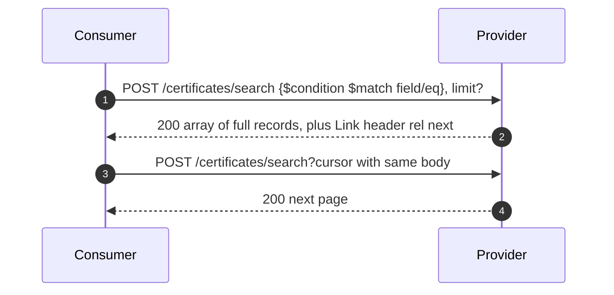

# Certo — Supported Flows

This document describes the interaction flows Certo implements from the **CX-0135 Company Certificate
Management (CCM) v3** data-plane wire protocol, and **ties each flow to the tests that cover it** so they
can be correlated. See the [README](../README.md) for build/run + curl examples and [`docs/ccm/`](ccm)
for the vendored spec.

**Test-class legend** (used in every "Tests" line and in the [traceability matrix](#traceability-matrix)):

| Code | Test class | Style |
|------|------------|-------|
| **[provider]** | `ProviderCertificateApiTest` | provider endpoints via MockMvc |
| **[consumer]** | `ConsumerCertificateApiTest` | consumer end-to-end vs a real server (port 18080) |
| **[poll]** | `ConsumerPollFlowTest` | consumer poll path, unreachable push (port 18081) |
| **[callback]** | `Ccm300ReporterTest` | acceptance-callback shape via MockWebServer |

## The model

Every flow derives from two independent state machines (CX-0135 §2):

- A **Certificate Exchange** (correlated by `exchangeId`) — one delivery interaction: a provider-owned
  **Fulfillment** phase, then a consumer-owned **Acceptance** phase.
- A **Certificate Lifecycle** — the artifact over time (`CREATED → MODIFIED* → WITHDRAWN`), keyed by
  `certificateId` + `revision`, independent of any exchange. A certificate is JSON metadata that
  references `documents[]` retrieved separately by opaque, revision-independent id.



> **`RETRIEVED` is optional** (CX-0135 §2.1.3): an exchange may report it as a delivery receipt, or
> transition straight from `FULFILLED` to a terminal verdict. Certo's consumer takes the direct path —
> one acceptance callback rather than a separate receipt first.

> **Decoupling:** both roles run in one process, but the provider never auto-calls the consumer (or
> vice versa) — that wiring is the DSP control plane, which is out of scope. Each flow is driven by
> calling the relevant endpoints; cross-role calls are real OkHttp calls against the counterparty
> endpoint the siglet cache returns for the flow.

## Flow index

| Flow | What | Variants |
|------|------|----------|
| **A** | Consumer-initiated **pull** | A1 held/immediate · A2 async+push · A3 async+poll · A4 backend-declines · A5 backend-fails |
| **B** | Provider-initiated **push** (lifecycle `CREATED`) | B1 accepted · B2 rejected (expired) · B3 errored |
| **C** | Certificate **lifecycle** (`MODIFIED` / `WITHDRAWN`) | C1 revise · C2 withdraw · C3 end-to-end |
| **D** | **Search** / discovery | D1 by type · D2 by location · D3 unsupported field (501) · D4 pagination |
| **E** | **Cross-cutting** protocol rules (state machine, CloudEvents, documents, batch, idempotency) | — |

---

## Flow A — Consumer-initiated pull

The consumer opens its **own** request, the certificate becomes available (immediately if held, else
asynchronously), then the consumer retrieves it and reports acceptance. Driven by the management trigger
`POST /management/v1/participant-contexts/{pc}/consumer/certificate-requests` (`{pc}` = the consumer tenant).

The `alt` boxes below are **mutually-exclusive paths** (like `if`/`else`) — exactly one branch runs per
request. They differ *only* in how the consumer reaches `FULFILLED`; the retrieve + accept tail after the
boxes is identical for all three variants:

- **A1** — the provider already holds a matching certificate → `FULFILLED` in the request response.
- **A2 / A3** — nothing held, so the provider answers `CERTIFICATION_REQUESTED` and waits for its
  certification-authority backend to issue the certificate (an operator drives this through the management
  API); the consumer then learns it is `FULFILLED` either by a **push** (A2) or by **polling** (A3).

```mermaid
sequenceDiagram
    autonumber
    actor T as Trigger
    participant C as Consumer
    participant P as Provider
    T->>C: POST /management/v1/participant-contexts/{pc}/consumer/certificate-requests {providerBpn, providerDid, certificateType, certifiedLocationBpns?}
    C->>P: POST /certificate-requests
    alt A1 provider already holds a matching cert
        P-->>C: 202 status FULFILLED
    else otherwise provider must produce it
        P-->>C: 202 status CERTIFICATION_REQUESTED
        Note over P: backend issues cert (POST /management/v1/participant-contexts/{pc}/certificates); waiting exchange fulfilled
        alt A2 consumer learns via push
            P->>C: POST /certificate-notifications, CertificateFulfillmentStatus FULFILLED
        else A3 consumer learns via poll
            C->>P: POST /management/v1/participant-contexts/{pc}/consumer/certificate-requests/{id}/poll then GET /certificate-requests/{id}
            P-->>C: 200 status FULFILLED
        end
    end
    Note over C,P: common tail, identical for A1/A2/A3
    C->>P: GET /certificates/{certificateId}?revision=
    P-->>C: 200 JSON metadata with documents[] references
    C->>P: GET /documents/{documentId}
    P-->>C: 200 document binary (Content-Type = mediaType)
    C->>P: POST /certificate-acceptance-notifications, status ACCEPTED
    P-->>C: 204 provider records the outcome
```

1. **Open** — the consumer calls the provider's `POST /certificate-requests`; the provider assigns the
   `exchangeId` (`HTTP 202`) and records a consumer-side exchange. A held cert returns its
   `certificateId`/`revision` at once; for an async request they are assigned only when the certificate is issued.
2. **Become available** — any certificate type is accepted: if a held certificate covers the requested
   `certifiedLocationBpns` the provider returns `FULFILLED` at once; otherwise `CERTIFICATION_REQUESTED`, and
   the exchange waits for the certification-authority backend. When the backend issues the certificate —
   uploading its document(s) via `POST /management/v1/participant-contexts/{pc}/documents`, then
   `POST /management/v1/participant-contexts/{pc}/certificates` referencing them — every waiting exchange it
   covers is fulfilled; if it cannot, the exchange ends `FAILED`
   (`POST /management/v1/participant-contexts/{pc}/certificate-requests/{id}/fail`) or `DECLINED`
   (`POST …/certificate-requests/{id}/decline`). The consumer learns the outcome by **push** or **poll**.
3. **Retrieve (two-step)** — `GET /certificates/{id}?revision=` → JSON metadata listing the documents by
   reference; then `GET /documents/{documentId}` for each binary. Available only once `FULFILLED`.
4. **Report acceptance** — the consumer POSTs a terminal `ACCEPTED`/`REJECTED`/`ERRORED` directly
   (`RETRIEVED` is optional and skipped); the provider records it.

**Variants & tests**

| # | Variant | Tests |
|---|---------|-------|
| **A1** | Held cert → immediate `FULFILLED` → accepted | `consumerInitiatedPull_heldCertificate_fulfilledImmediatelyAndAccepted` **[consumer]**; `requestOfferedType_fulfilledImmediately_andPollable` **[provider]** |
| **A2** | Async fulfillment learned via **push** | `consumerInitiatedPull_pushOnFulfillment_retrievesAndAccepts`, `fulfillmentNotification_accepted` **[consumer]**; `request_notHeld_waitsThenFulfillsWhenCertificateAdded` **[provider]** |
| **A3** | Async fulfillment learned via **poll** | `consumerInitiatedPull_pollForFulfillment_retrievesAndAccepts` **[poll]** |
| **A4** | Backend declines → `DECLINED` | `consumerInitiatedPull_backendDecline_recordsDeclinedNoAcceptance` **[consumer]**; `declineRequest_endsInDeclined`, `requestMissingType_badRequest` **[provider]** |
| **A5** | Fulfillment `FAILED` (backend cannot issue) | `consumerInitiatedPull_backendFailure_recordsFailedNoAcceptance` **[consumer]**; `request_backendFailure_endsInFailed` **[provider]** |

Provider-endpoint coverage for the steps: poll/`404` `requestStatus_unknownExchange_notFound` **[provider]**;
retrieve `retrieveCertificate_returnsJsonMetadataWithDocumentReferences`, `retrieveCertificate_specificRevision`,
`retrieveCertificate_unknown_notFound`, document API `retrieveDocument_returnsBinaryWithItsMediaType`,
`retrieveDocument_unknown_notFound` **[provider]**; acceptance recording + error rules
`acceptanceNotification_recordsStatus_thenUnknownIs404_andRejectedNeedsErrors` **[provider]**; acceptance
callback shape `reportsAcceptedAsCloudEvent`, `reportsRejectedWithErrors`, `deliveryFailureIsSwallowed`
**[callback]**; acceptance-status `404` `acceptanceStatus_unknownExchange_notFound` **[consumer]**.

---

## Flow B — Provider-initiated push (lifecycle CREATED)

The provider publishes a held certificate: it opens+stores a `FULFILLED` exchange and pushes a
`CertificateLifecycleStatus` `CREATED` event carrying the **light-triage** certificate subset. The
consumer **pulls** the full metadata + documents (push-pull, no embedded content), evaluates, and
reports back, which the provider records — the whole loop from one publish trigger.



1. **Publish** — `POST /management/v1/participant-contexts/{pc}/certificates/{id}/publish` opens+stores a
   `FULFILLED` exchange and pushes the `CREATED` event. Only `CREATED` opens an exchange.
2. **Retrieve + evaluate** — the consumer pulls the metadata and each document, then decides.
3. **Report back** — the consumer reports the terminal status directly (`RETRIEVED` optional, skipped);
   the provider records it (it owns the exchange). Inspect via `GET /certificate-acceptance-status/{id}` (consumer) and
   `GET /management/v1/participant-contexts/{pc}/certificate-exchanges/{id}` (provider).

**Variants & tests**

| # | Variant | Tests |
|---|---------|-------|
| **B1** | Valid cert → `ACCEPTED` (full loop) | `providerInitiatedPush_closesLoopBackToProvider`, `createdLifecycleEvent_retrievesValidCertificate_andAccepts` **[consumer]** |
| **B2** | Expired cert → `REJECTED` | `createdLifecycleEvent_retrievesExpiredCertificate_andRejects` **[consumer]** |
| **B3** | Unretrievable → `ERRORED` | `createdLifecycleEvent_unknownCertificate_isErrored` **[consumer]** |

---

## Flow C — Certificate lifecycle (MODIFIED / WITHDRAWN)

The provider changes a certificate's **state** and, as a **separate** step, notifies a named consumer,
which keeps a synchronized view. State changes tell no one; a lifecycle `publish` targets one consumer
(reaching several is several publishes). These transitions do **not** open an exchange (§2.2.4).



1. **Revise (state)** — `POST /management/v1/participant-contexts/{pc}/certificates/{id}/revisions` creates a
   new version: appends a `revision` with the caller's issued validity + documents (uploaded first via
   `POST /management/v1/participant-contexts/{pc}/documents`); `CREATED → MODIFIED`, cert-level metadata carried
   over. No notification.
2. **Withdraw (state)** — `POST /management/v1/participant-contexts/{pc}/certificates/{id}/withdraw` sets `WITHDRAWN`:
   `GET /certificates/{id}` → `200` with the minimal `{certificateId, status: WITHDRAWN}` body (§3.3.2),
   search excludes it, a second withdraw → `409`. No notification.
3. **Publish (notify)** — `POST /management/v1/participant-contexts/{pc}/certificates/{id}/publish` with
   `{"lifecycleStatus": …}` sends a `MODIFIED` (light subset) or `WITHDRAWN` (certificateId only) event to one named target consumer.
4. **Consumer reacts** — updates `GET /management/v1/participant-contexts/{pc}/consumer/certificates/{id}`:
   `MODIFIED` bumps the known revision, `WITHDRAWN` marks it unavailable.

**Variants & tests**

| # | Variant | Tests |
|---|---------|-------|
| **C1** | Provider revise (new revision served + searched) | `revise_appendsNewRevision_servedAndSearchable` **[provider]** |
| **C2** | Provider withdraw (`200` status body + excluded + `409`) | `withdraw_returnsWithdrawnStatusBody_excludedFromSearch_andSecondWithdrawConflicts` **[provider]** |
| **C3** | Consumer reacts (`MODIFIED`/`WITHDRAWN`) | `lifecycleModified_updatesConsumerKnownCertificate`, `lifecycleWithdrawn_marksConsumerKnownCertificateUnavailable`, `lifecycle_endToEnd_modifyThenWithdraw_consumerReacts` **[consumer]** |

---

## Flow D — Search / discovery



1. **Search** — the body is the §3.3.4 grammar: a `$condition.$match` array of `{$field, $eq}` clauses
   combined with AND. The provider supports `certificateType` and `certifiedLocations.{bpnl,bpns,bpna}`;
   an unsupported field → `501`. Returns the latest revision of each matching certificate (`WITHDRAWN`
   excluded), without document binaries. A search alone does **not** establish an exchange.
2. **Paginate** — with `limit` set, an RFC 8288 `Link` header carries `next`/`prev` opaque cursors;
   re-POST the same body against the linked URL.

**Variants & tests**

| # | Variant | Tests |
|---|---------|-------|
| **D1** | Search by type → latest revision | `search_byType_returnsLatestRevision` **[provider]** |
| **D2** | Search by certified-location BPN | `search_byCertifiedLocationBpns_matches` **[provider]** |
| **D3** | Unsupported field → `501` | `search_unsupportedField_notImplemented` **[provider]** |
| **D4** | Cursor pagination + Link relations | `search_paginates_withNextPrevLinks` **[provider]** |

---

## Flow E — Cross-cutting protocol rules

Not a sequence flow — rules that apply across A–D, each with its covering tests.

| # | Rule | Behavior | Tests |
|---|------|----------|-------|
| **E1** | **CloudEvents envelope** | Required `specversion`=="1.0", `type`, `source`, `id`, `sourcebpn` → else `400` | `acceptanceEvent_missingSourcebpn_isBadRequest`, `acceptanceEvent_invalidEnvelope_isBadRequest` **[provider]**; `unsupportedEventType_badRequest` **[consumer]** |
| **E2** | **Idempotency** | Duplicate `source`+`id` ignored (both sides) | `acceptanceEvent_duplicateIsIgnored` **[provider]**; `duplicateLifecycleEvent_isIgnored` **[consumer]** |
| **E3** | **Batch atomicity** | Validate all before applying; one bad event applies none | `acceptanceBatch_isAtomic_oneBadEventAppliesNone` **[provider]**; `notificationBatch_isAtomic_oneBadEventAppliesNone`, `batchOfEvents_accepted` **[consumer]** |
| **E4** | **State machine** | Illegal transitions, terminal immutability, acceptance-before-`FULFILLED` → `409` | `acceptance_beforeFulfilled_isConflict`, `acceptance_afterTerminal_isConflict` **[provider]** |
| **E7** | **Optional `RETRIEVED`** | Terminal verdict accepted directly from `FULFILLED`; the optional `RETRIEVED` receipt still valid | `acceptanceNotification_directTerminalWithoutRetrieved_isRecorded`, `acceptanceNotification_optionalRetrievedThenTerminal_isRecorded` **[provider]** |
| **E5** | **Re-attempt = new exchange** | Each request opens a distinct `exchangeId` | `reattempt_opensADistinctExchange` **[provider]** |
| **E6** | **Two-step retrieval** | `GET /certificates/{id}` is JSON metadata + `documents[]` refs; binaries served by `GET /documents/{id}` with `Content-Type = mediaType` | `retrieveCertificate_returnsJsonMetadataWithDocumentReferences`, `retrieveDocument_returnsBinaryWithItsMediaType`, `retrieveDocument_unknown_notFound` **[provider]** |
| **E8** | **Per-site error specifier** | Acceptance `errors[]` may carry a `specifier` (e.g. a BPNS) scoping the error | `acceptanceNotification_rejectedWithPerSiteSpecifier_isRecorded` **[provider]** |

---

## Traceability matrix

Every flow/variant ↔ its tests (legend above). All 50 tests are accounted for.

| Flow | Test(s) |
|------|---------|
| **A1** held/immediate | `consumerInitiatedPull_heldCertificate_fulfilledImmediatelyAndAccepted` **[consumer]**, `requestOfferedType_fulfilledImmediately_andPollable` **[provider]** |
| **A2** async + push | `consumerInitiatedPull_pushOnFulfillment_retrievesAndAccepts` **[consumer]**, `fulfillmentNotification_accepted` **[consumer]**, `request_notHeld_waitsThenFulfillsWhenCertificateAdded` **[provider]** |
| **A3** async + poll | `consumerInitiatedPull_pollForFulfillment_retrievesAndAccepts` **[poll]** |
| **A4** backend declines | `consumerInitiatedPull_backendDecline_recordsDeclinedNoAcceptance` **[consumer]**, `declineRequest_endsInDeclined` **[provider]**, `requestMissingType_badRequest` **[provider]** |
| **A5** failed | `consumerInitiatedPull_backendFailure_recordsFailedNoAcceptance` **[consumer]**, `request_backendFailure_endsInFailed` **[provider]** |
| **A** steps (poll/retrieve/accept) | `requestStatus_unknownExchange_notFound`, `retrieveCertificate_returnsJsonMetadataWithDocumentReferences`, `retrieveCertificate_specificRevision`, `retrieveCertificate_unknown_notFound`, `acceptanceNotification_recordsStatus_thenUnknownIs404_andRejectedNeedsErrors` **[provider]**; `acceptanceStatus_unknownExchange_notFound` **[consumer]**; `reportsAcceptedAsCloudEvent`, `reportsRejectedWithErrors`, `deliveryFailureIsSwallowed` **[callback]** |
| **B1** push → accepted | `providerInitiatedPush_closesLoopBackToProvider`, `createdLifecycleEvent_retrievesValidCertificate_andAccepts` **[consumer]** |
| **B2** push → rejected | `createdLifecycleEvent_retrievesExpiredCertificate_andRejects` **[consumer]** |
| **B3** push → errored | `createdLifecycleEvent_unknownCertificate_isErrored` **[consumer]** |
| **C1** revise | `revise_appendsNewRevision_servedAndSearchable` **[provider]** |
| **C2** withdraw | `withdraw_returnsWithdrawnStatusBody_excludedFromSearch_andSecondWithdrawConflicts` **[provider]** |
| **C3** consumer reacts | `lifecycleModified_updatesConsumerKnownCertificate`, `lifecycleWithdrawn_marksConsumerKnownCertificateUnavailable`, `lifecycle_endToEnd_modifyThenWithdraw_consumerReacts` **[consumer]** |
| **D1** search by type | `search_byType_returnsLatestRevision` **[provider]** |
| **D2** search by location | `search_byCertifiedLocationBpns_matches` **[provider]** |
| **D3** unsupported field `501` | `search_unsupportedField_notImplemented` **[provider]** |
| **D4** pagination | `search_paginates_withNextPrevLinks` **[provider]** |
| **E1** envelope | `acceptanceEvent_missingSourcebpn_isBadRequest`, `acceptanceEvent_invalidEnvelope_isBadRequest` **[provider]**, `unsupportedEventType_badRequest` **[consumer]** |
| **E2** idempotency | `acceptanceEvent_duplicateIsIgnored` **[provider]**, `duplicateLifecycleEvent_isIgnored` **[consumer]** |
| **E3** batch atomicity | `acceptanceBatch_isAtomic_oneBadEventAppliesNone` **[provider]**, `notificationBatch_isAtomic_oneBadEventAppliesNone` **[consumer]**, `batchOfEvents_accepted` **[consumer]** |
| **E4** state machine | `acceptance_beforeFulfilled_isConflict`, `acceptance_afterTerminal_isConflict` **[provider]** |
| **E5** re-attempt | `reattempt_opensADistinctExchange` **[provider]** |
| **E6** two-step retrieval | `retrieveCertificate_returnsJsonMetadataWithDocumentReferences`, `retrieveDocument_returnsBinaryWithItsMediaType`, `retrieveDocument_unknown_notFound` **[provider]** |
| **E7** optional `RETRIEVED` | `acceptanceNotification_directTerminalWithoutRetrieved_isRecorded`, `acceptanceNotification_optionalRetrievedThenTerminal_isRecorded` **[provider]** |
| **E8** per-site specifier | `acceptanceNotification_rejectedWithPerSiteSpecifier_isRecorded` **[provider]** |
| _infra_ | `contextLoads` **[CertoApplicationTest]** |

---

## Simplifications (not protocol limitations)

- A held certificate covering the requested locations fulfils **immediately**; otherwise the request
  is `CERTIFICATION_REQUESTED` and waits for the certification-authority backend. In this build the backend is
  driven through the management API (every call under `/management/v1/participant-contexts/{pc}/…`, `{pc}` =
  the provider tenant): it uploads the issued document(s) via `POST …/{pc}/documents`, then
  `POST …/{pc}/certificates` (referencing them) issues the certificate as a **state change only**.
  The client then discovers the waiting exchanges the certificate covers (`GET …/{pc}/certificates/{id}/fulfillable-requests`)
  and completes each **per-exchange** (`POST …/{pc}/certificate-requests/{id}/fulfill`, carrying that
  consumer's `flowId`), or ends one in `FAILED`/`DECLINED` via `/fail` / `/decline`.
- On `CREATED`/`FULFILLED` the consumer genuinely retrieves over HTTP (OkHttp), evaluates synchronously,
  and reports the terminal outcome back directly (`RETRIEVED` is optional and skipped — a single
  acceptance callback); the counterparty endpoint comes from the siglet cache per flow (no DSP
  discovery). A fuller implementation might validate asynchronously and emit an interim
  `RETRIEVED` receipt, and MAY re-retrieve after `MODIFIED`.
- Persistence is Spring Data JPA (embedded H2 by default — resets on restart; Postgres under `prod`); three sample certificates are seeded at startup (an ISO9001
  with revisions 1 & 2, an ISO14001, and an expired IATF16949). Certificate ids are UUIDs (the same value is
  the v2.4.0 `documentId`); the seeder uses fixed UUIDs.

## Multi-tenancy

Every certificate and exchange belongs to a **participant context** (tenant: `bpn`, `source`, `did`, plus a
`participantContextId`). Tenants are created via `POST /management/v1/participant-contexts` — there is no
config default, and the id never appears on the CCM wire. The id is a server-generated UUID when omitted,
or caller-chosen when supplied (URL-safe, unique). Everything is tenant-scoped, no
exceptions: an inbound protocol call is scoped to the tenant its token **audience** (`aud` = a tenant DID)
resolves to (fulfil only from that tenant's holdings; retrieval/search never cross the boundary), and a
management call names the tenant **in the path** — every provider/consumer management operation lives under
`/management/v1/participant-contexts/{participantContextId}/…` (siglet's `/tokens/{participant_context_id}/…`
convention). A resource addressed by id must belong to the path tenant (else 404); queries return only that
tenant's resources. The only tenant-agnostic management endpoints are the participant-context registry itself
(`POST`/`GET /management/v1/participant-contexts`).

## Security & the consumer extension point

Security tokens on the CCM protocol layer are **always on** and always come from a **siglet** STS
(`certo.security.siglet-base-url` is required; dev/test point at a mock siglet). Inbound protocol calls are
verified via siglet's revocation-aware `POST /tokens/verify`; the verified caller becomes the exchange
counterparty and the audience resolves to the receiving tenant. Outbound calls are made on behalf of the
sender's participant context — the token **and counterparty endpoint** come from the siglet cache
(`GET /tokens/{participantContextId}/{flowId}`), so the URL travels with the token (no configured-URL
fallback). `flowId` is **ephemeral** —
supplied fresh on each management request that triggers an outbound call (`publish`, `fulfill`/`fail`/`decline`,
consumer `initiate`/`poll`/`retrieve`/`accept`), never persisted. The management API itself is never
token-secured; it only carries `flowId` as data.

Inbound consumer notifications are **recorded, then emitted** to `InboundNotificationListener` beans (a
neutral `InboundCcmEvent`, fire-and-forget). The consumer never decides acceptance itself: a plugged-in
client (in-process listener, or the `WebhookNotificationListener` when
`certo.consumer.notification-callback-url` is set) drives the consumer management API
(`/consumer/exchanges/{id}/retrieve` + `/accept`) on its own timeline, supplying its live `flowId`. This is
the consumer-side analogue of the provider's certification-authority backend. (Residual: an *unsolicited*
provider push still needs the client to have a consumer→provider flow to retrieve over — the control
plane's job.)
