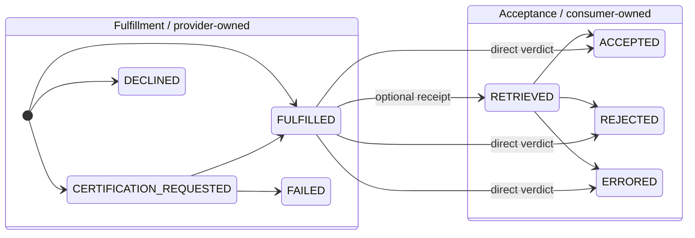
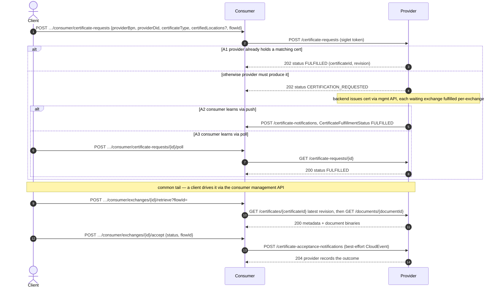
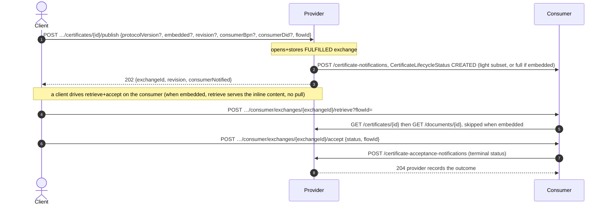
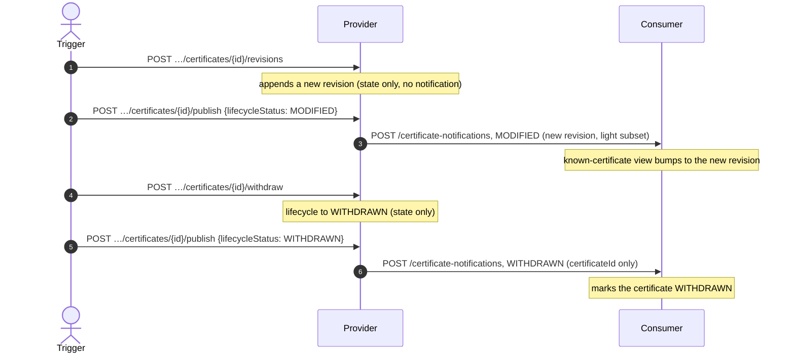
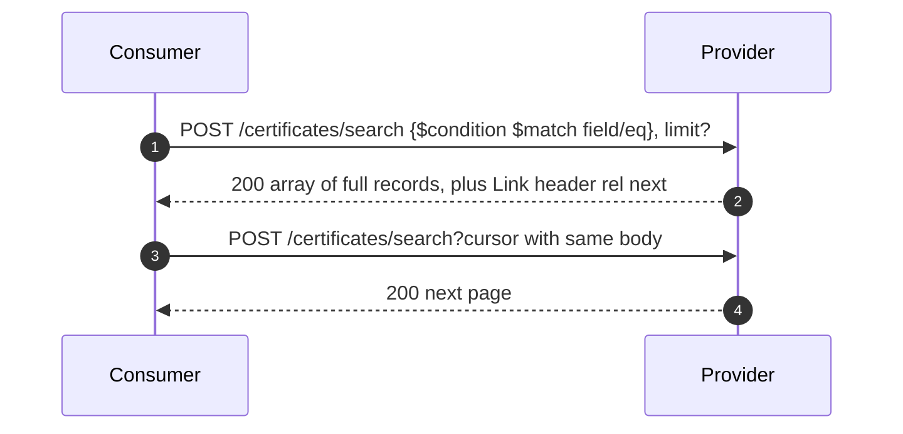
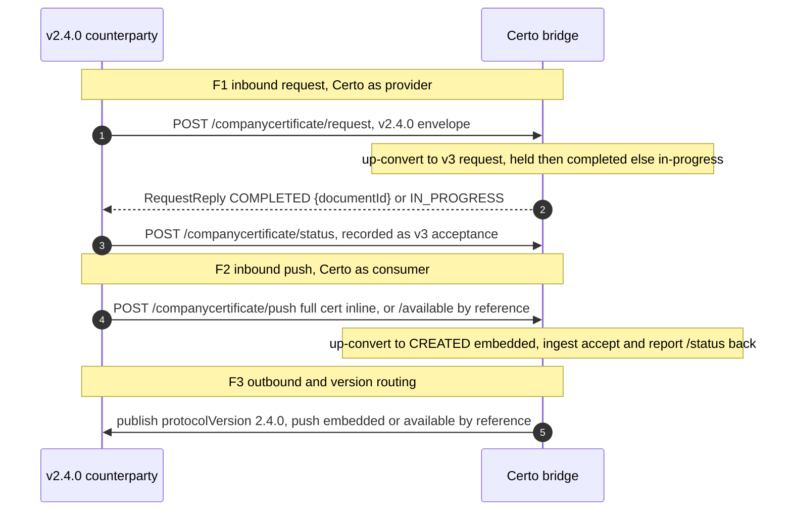

# Certo — Supported Flows

This document describes the interaction flows Certo implements. The native protocol is **CX-0135 Company Certificate
Management (CCM) v3.0.0** (CloudEvents); Certo also bridges the legacy **v2.4.0** message API
(`/companycertificate/*`) — covered in [Flow F](#flow-f--v240-legacy-bridge). See the [README](../README.md)
for build/run + curl examples and [`docs/ccm/`](ccm) for the vendored spec.

> **The consumer is a pure mechanism.** Inbound `CREATED` / `FULFILLED` events are **recorded and emitted**
> to listeners — the consumer runtime **never decides acceptance itself**. A client (an in-process
> `InboundNotificationListener`, or the optional `WebhookNotificationListener`) drives the consumer
> management API — `retrieve` (pull for inspection) then `accept` (supply the `ACCEPTED`/`REJECTED`/`ERRORED`
> verdict) — on its own timeline, carrying its live `flowId`. Every "the consumer accepts/rejects" below
> means "a client drove `accept` with that verdict."

## The model

Every flow derives from two independent state machines (CX-0135 §2):

- A **Certificate Exchange** (correlated by `exchangeId`) — one delivery interaction: a provider-owned **Fulfillment**
  phase, then a consumer-owned **Acceptance** phase.
- A **Certificate Lifecycle** — the artifact over time (`CREATED → MODIFIED* → WITHDRAWN`), keyed by
  `certificateId` + `revision`, independent of any exchange. A certificate is JSON metadata that references
  `documents[]` retrieved separately by opaque, revision-independent id.

```mermaid
stateDiagram-v2
    direction LR
    state "Fulfillment / provider-owned" as F {
        [*] --> CERTIFICATION_REQUESTED
        [*] --> FULFILLED
        [*] --> DECLINED
        CERTIFICATION_REQUESTED --> FULFILLED
        CERTIFICATION_REQUESTED --> FAILED
    }
    state "Acceptance / consumer-owned" as A {
        RETRIEVED --> ACCEPTED
        RETRIEVED --> REJECTED
        RETRIEVED --> ERRORED
    }
    FULFILLED --> RETRIEVED: optional receipt
    FULFILLED --> ACCEPTED: direct verdict
    FULFILLED --> REJECTED: direct verdict
    FULFILLED --> ERRORED: direct verdict
```

> **`RETRIEVED` is optional** (CX-0135 §2.1.3): an exchange may report it as a delivery receipt, or
> transition straight from `FULFILLED` to a terminal verdict. Certo's default client takes the direct path.
> `DECLINED`/`FAILED`/`ACCEPTED`/`REJECTED`/`ERRORED` are **terminal** (immutable).

> **Decoupling.** Both roles run in one process, but the provider never auto-calls the consumer (or vice
> versa) — that wiring is the DSP control plane, which is out of scope. Each flow is driven by calling the
> relevant endpoints; cross-role calls are real OkHttp calls (through a **retrying** client) against the
> counterparty endpoint the siglet cache returns for the flow.

## Flow index

| Flow  | What                                                                                         | Variants                                                                                                                |
|-------|----------------------------------------------------------------------------------------------|-------------------------------------------------------------------------------------------------------------------------|
| **A** | Consumer-initiated **pull**                                                                  | A1 held/immediate · A2 async+push · A3 async+poll · A4 backend-declines · A5 backend-fails                              |
| **B** | Provider-initiated **push**                                                                  | B1 accepted · B2 rejected (expired) · B3 retrieve-fails · B4 **embedded** (no pull) · B5 provider **polls** the verdict |
| **C** | Certificate **lifecycle** (`MODIFIED` / `WITHDRAWN`)                                         | C1 revise · C2 withdraw · C3 consumer reacts                                                                            |
| **D** | **Search** / discovery                                                                       | D1 by type · D2 by location · D3 unsupported field (501) · D4 pagination                                                |
| **E** | **Cross-cutting** rules (state machine, CloudEvents, batch, **idempotency**, reconciliation) | E1–E9                                                                                                                   |
| **F** | **v2.4.0 legacy bridge** (`/companycertificate/*`)                                           | F1 inbound request · F2 inbound push · F3 outbound + version routing                                                    |

---

## Flow A — Consumer-initiated pull

The consumer opens its **own** request; the certificate becomes available (immediately if held, else asynchronously);
then a client drives retrieve + accept. Driven by the management trigger
`POST /management/v1/participant-contexts/{pc}/consumer/certificate-requests` (`{pc}` = the consumer tenant).

The `alt` boxes are **mutually-exclusive paths** — exactly one runs per request. They differ *only* in how the consumer
reaches `FULFILLED`; the client-driven retrieve + accept tail is identical for all three.

```mermaid
sequenceDiagram
    autonumber
    actor T as Client
    participant C as Consumer
    participant P as Provider
    T->>C: POST …/consumer/certificate-requests {providerBpn, providerDid, certificateType, certifiedLocations?, flowId}
    C->>P: POST /certificate-requests (siglet token)
    alt A1 provider already holds a matching cert
        P-->>C: 202 status FULFILLED (certificateId, revision)
    else otherwise provider must produce it
        P-->>C: 202 status CERTIFICATION_REQUESTED
        Note over P: backend issues cert via mgmt API, each waiting exchange fulfilled per-exchange
        alt A2 consumer learns via push
            P->>C: POST /certificate-notifications, CertificateFulfillmentStatus FULFILLED
        else A3 consumer learns via poll
            T->>C: POST …/consumer/certificate-requests/{id}/poll
            C->>P: GET /certificate-requests/{id}
            P-->>C: 200 status FULFILLED
        end
    end
    Note over T,P: common tail — a client drives it via the consumer management API
    T->>C: POST …/consumer/exchanges/{id}/retrieve?flowId=
    C->>P: GET /certificates/{certificateId} latest revision, then GET /documents/{documentId}
    P-->>C: 200 metadata + document binaries
    T->>C: POST …/consumer/exchanges/{id}/accept {status, flowId}
    C->>P: POST /certificate-acceptance-notifications (best-effort CloudEvent)
    P-->>C: 204 provider records the outcome
```

1. **Open** — the consumer calls the provider's `POST /certificate-requests`; the provider assigns the
   `exchangeId` (`HTTP 202`) and the consumer records its side. A held cert returns its
   `certificateId`/`revision` at once; for an async request they are assigned only when the certificate is issued.
   Request-open is **idempotent** (see [E5](#flow-e--cross-cutting-rules)).
2. **Become available** — any certificate type is accepted. A held certificate covering the requested
   `certifiedLocations` → `FULFILLED` at once; otherwise `CERTIFICATION_REQUESTED`, and the exchange waits for the
   certification-authority backend (driven through the management API — see
   [Simplifications](#simplifications-not-protocol-limitations)). The consumer learns the outcome by **push**
   (A2) or **poll** (A3); an unfulfillable request ends `FAILED` (A5) or `DECLINED` (A4).
3. **Retrieve (two-step, client-driven)** — `POST …/consumer/exchanges/{id}/retrieve` makes the consumer pull
   `GET /certificates/{id}` (**always the latest revision**, CX-0135 §3.3.2) → JSON metadata listing documents by
   reference, then `GET /documents/{documentId}` for each binary. Available only once `FULFILLED`.
4. **Report acceptance (client-driven)** — `POST …/consumer/exchanges/{id}/accept {status}` records the client's
   terminal verdict and reports it to the provider (a best-effort CloudEvent; `RETRIEVED` optional and skipped). The
   provider records it.

**Variants**

| #      | Variant                                                                                                           |
|--------|-------------------------------------------------------------------------------------------------------------------|
| **A1** | Provider already holds a matching cert → immediate `FULFILLED` → accepted                                         |
| **A2** | Nothing held → `CERTIFICATION_REQUESTED`; async fulfillment learned via **push** (`CertificateFulfillmentStatus`) |
| **A3** | Same, but the consumer learns fulfillment via **poll** (the push is unreachable)                                  |
| **A4** | Backend declines the request → `DECLINED`                                                                         |
| **A5** | Backend cannot issue → fulfillment `FAILED`                                                                       |

---

## Flow B — Provider-initiated push

`POST /management/v1/participant-contexts/{pc}/certificates/{id}/publish` opens+stores a `FULFILLED`
exchange and pushes a `CertificateLifecycleStatus` `CREATED` event to one named target consumer. By default, the event
carries only the **light-triage** subset and the consumer **pulls** the rest (push-pull); **embedded** publish
(`{"embedded":true}`) inlines the full certificate + document content so no pull is needed (B4). The push only
**records** the exchange; a client then drives retrieve + accept (or the provider **polls** the verdict, B5).

```mermaid
sequenceDiagram
    autonumber
    actor T as Client
    participant P as Provider
    participant C as Consumer
    T->>P: POST …/certificates/{id}/publish {protocolVersion?, embedded?, revision?, consumerBpn?, consumerDid?, flowId}
    Note over P: opens+stores FULFILLED exchange
    P->>C: POST /certificate-notifications, CertificateLifecycleStatus CREATED (light subset, or full if embedded)
    P-->>T: 202 {exchangeId, revision, consumerNotified}
    Note over T,P: a client drives retrieve+accept on the consumer (when embedded, retrieve serves the inline content, no pull)
    T->>C: POST …/consumer/exchanges/{exchangeId}/retrieve?flowId=
    C->>P: GET /certificates/{id} then GET /documents/{id}, skipped when embedded
    T->>C: POST …/consumer/exchanges/{exchangeId}/accept {status, flowId}
    C->>P: POST /certificate-acceptance-notifications (terminal status)
    P-->>C: 204 provider records the outcome
```

Inspect via `GET /certificate-acceptance-status/{id}` (consumer view) and
`GET …/{pc}/certificate-exchanges/{id}` (provider view — a management/inspection endpoint, not in CX-0135). The
`publish` body selects the target: `protocolVersion` (`3.0.0` native, or
`2.4.0` → [Flow F](#flow-f--v240-legacy-bridge)),
`embedded`, `revision`, and the named `consumerBpn`/`consumerDid`. An empty body publishes the latest revision to the
native consumer, by reference. Only `CREATED` opens an exchange.

**Variants**

| #      | Variant                                                                     |
|--------|-----------------------------------------------------------------------------|
| **B1** | Valid cert → **client** accepts (full loop back to provider)                |
| **B2** | Expired cert → **client** rejects (`REJECTED`, "expired")                   |
| **B3** | Cert not held at provider → retrieve returns **502** (client would `ERROR`) |
| **B4** | **Embedded** push → accept from inline content, **no pull**                 |
| **B5** | Provider **polls** the consumer's verdict (instead of the push)             |

> **B5 — provider poll-acceptance (CX-0135 §2.1).** Rather than wait for the consumer's acceptance report,
> the provider can pull it: `POST …/{pc}/certificate-exchanges/{id}/poll-acceptance?flowId=` fetches the
> consumer's verdict (`404`/no-verdict before the consumer decides, the verdict after). This is the
> provider-side counterpart of the consumer's poll in A3.

---

## Flow C — Certificate lifecycle (MODIFIED / WITHDRAWN)

The provider changes a certificate's **state** and, as a **separate** step, notifies a named consumer, which keeps a
synchronized view. State changes tell no one; a lifecycle `publish` targets one consumer (reaching several is several
publishes). These transitions do **not** open an exchange (§2.2.4).

```mermaid
sequenceDiagram
    autonumber
    actor T as Trigger
    participant P as Provider
    participant C as Consumer
    T->>P: POST …/certificates/{id}/revisions
    Note over P: appends a new revision (state only, no notification)
    T->>P: POST …/certificates/{id}/publish {lifecycleStatus: MODIFIED}
    P->>C: POST /certificate-notifications, MODIFIED (new revision, light subset)
    Note over C: known-certificate view bumps to the new revision
    T->>P: POST …/certificates/{id}/withdraw
    Note over P: lifecycle to WITHDRAWN (state only)
    T->>P: POST …/certificates/{id}/publish {lifecycleStatus: WITHDRAWN}
    P->>C: POST /certificate-notifications, WITHDRAWN (certificateId only)
    Note over C: marks the certificate WITHDRAWN
```

1. **Revise (state)** — `POST …/certificates/{id}/revisions` appends a `revision` with the caller's issued validity +
   documents (uploaded first via `POST …/{pc}/documents`); `CREATED → MODIFIED`, cert-level metadata carried over. No
   notification.
2. **Withdraw (state)** — `POST …/certificates/{id}/withdraw` sets `WITHDRAWN`: `GET /certificates/{id}` →
   `200` with the minimal `{certificateId, status: WITHDRAWN}` body (§3.3.2), search excludes it, a second withdraw →
   `409`. No notification.
3. **Publish (notify)** — `POST …/certificates/{id}/publish {"lifecycleStatus":…}` sends a `MODIFIED` (light subset) or
   `WITHDRAWN` (certificateId only) event to one named target consumer.
4. **Consumer reacts** — updates `GET …/{pc}/consumer/certificates/{id}`: `MODIFIED` bumps the known revision,
   `WITHDRAWN` marks it unavailable.

**Variants**

| #      | Variant                                                                              |
|--------|--------------------------------------------------------------------------------------|
| **C1** | Provider revise — the new revision is served and searchable                          |
| **C2** | Provider withdraw — `200` status body, excluded from search, a second withdraw `409` |
| **C3** | Consumer reacts to `MODIFIED` (bumps revision) / `WITHDRAWN` (marks unavailable)     |

---

## Flow D — Search / discovery

```mermaid
sequenceDiagram
    autonumber
    participant C as Consumer
    participant P as Provider
    C->>P: POST /certificates/search {$condition $match field/eq}, limit?
    P-->>C: 200 array of full records, plus Link header rel next
    C->>P: POST /certificates/search?cursor with same body
    P-->>C: 200 next page
```

1. **Search** — the body is the §3.3.4 grammar: a `$condition.$match` array of `{$field, $eq}` clauses AND-combined.
   Supported fields: `certificateType`, `certifiedLocations.{bpnl,bpns,bpna}`; an unsupported field → `501`. Returns the
   latest revision of each match (`WITHDRAWN` excluded), without binaries. A search alone does **not** establish an
   exchange.
2. **Paginate** — with `limit` set, an RFC 8288 `Link` header carries `next`/`prev` opaque cursors; re-POST the same
   body against the linked URL.

**Variants**

| #      | Variant                                             |
|--------|-----------------------------------------------------|
| **D1** | Search by `certificateType` → latest revision       |
| **D2** | Search by certified-location BPN (bpnl/bpns/bpna)   |
| **D3** | Unsupported field → `501`                           |
| **D4** | Cursor pagination via the RFC 8288 `Link` relations |

---

## Flow E — Cross-cutting rules

Not a sequence flow — rules that apply across the others.

| #      | Rule                                    | Behavior                                                                                                                                                                                                                                                                                                                          |
|--------|-----------------------------------------|-----------------------------------------------------------------------------------------------------------------------------------------------------------------------------------------------------------------------------------------------------------------------------------------------------------------------------------|
| **E1** | **CloudEvents envelope**                | Required `specversion`=="1.0", `type`, `source`, `id`, `sourcebpn` → else `400`                                                                                                                                                                                                                                                   |
| **E2** | **Event idempotency**                   | Duplicate `source`+`id` ignored (both sides); v2.4.0 dedups on `messageId`                                                                                                                                                                                                                                                        |
| **E3** | **Batch atomicity**                     | Validate all before applying; one bad event applies none                                                                                                                                                                                                                                                                          |
| **E4** | **State machine**                       | Illegal transitions, terminal immutability, acceptance-before-`FULFILLED` and after-terminal → `409`                                                                                                                                                                                                                              |
| **E5** | **Idempotent request-open**             | A repeat from the **same counterparty** (verified DID) for the same `certificateType` + locations (order-insensitive) **reuses the still-live exchange** — pending or `FULFILLED`; a **new** exchange opens only after a **terminal** outcome, or for a different counterparty. Provider `publish` dedups on an `idempotencyKey`. |
| **E6** | **Two-step retrieval**                  | `GET /certificates/{id}` is JSON metadata + `documents[]` refs (latest revision); binaries via `GET /documents/{id}` (`Content-Type = mediaType`)                                                                                                                                                                                 |
| **E7** | **Optional `RETRIEVED`**                | Terminal verdict accepted directly from `FULFILLED`; the optional `RETRIEVED` receipt is still valid                                                                                                                                                                                                                              |
| **E8** | **Per-site error specifier**            | Acceptance `errors[]` may carry a `specifier` (e.g. a BPNS) scoping the error                                                                                                                                                                                                                                                     |
| **E9** | **Best-effort report + reconciliation** | The acceptance report is best-effort and post-commit; the exchange is marked reported **only** on confirmed delivery. Outbound HTTP **retries** a transient `5xx`; a genuinely lost report stays surfaced by `POST …/consumer/exchanges/query {"awaitingAcceptanceOnly":true}` for a re-drive.                                    |

---

## Flow F — v2.4.0 legacy bridge

Certo interoperates with the **v2.4.0** message-envelope protocol (`/companycertificate/*`). Every inbound v2.4.0
message is **up-converted** to the canonical v3 model and driven through the same core; outbound, the
`ExchangeBinding` records the counterparty's version and a **dispatcher** selects the matching adapter, so a v3-native
core reaches a v2.4.0 counterparty transparently.

```mermaid
sequenceDiagram
    autonumber
    participant V as v2.4.0 counterparty
    participant B as Certo bridge
    Note over V,B: F1 inbound request, Certo as provider
    V->>B: POST /companycertificate/request, v2.4.0 envelope
    Note over B: up-convert to v3 request, held then completed else in-progress
    B-->>V: RequestReply COMPLETED {documentId} or IN_PROGRESS
    V->>B: POST /companycertificate/status, recorded as v3 acceptance
    Note over V,B: F2 inbound push, Certo as consumer
    V->>B: POST /companycertificate/push full cert inline, or /available by reference
    Note over B: up-convert to CREATED embedded, ingest accept and report /status back
    Note over V,B: F3 outbound and version routing
    B->>V: publish protocolVersion 2.4.0, push embedded or available by reference
```

- **F1 — inbound request (Certo is provider).** `POST /companycertificate/request` up-converts to a v3 request: a held
  certificate → `COMPLETED` carrying only the `documentId` (== `certificateId`); otherwise
  `IN_PROGRESS`. The counterparty's later `POST /companycertificate/status` is recorded as a v3 acceptance, correlated
  by `documentId` + the caller's **verified DID**.
- **F2 — inbound push (Certo is consumer).** `POST /companycertificate/push` (full certificate inline) is up-converted
  to a `CREATED` embedded event and ingested; the consumer accepts from the inline content and reports `/status` back. A
  re-push of the same certificate keeps its identity and bumps the revision; a duplicate `messageId` is idempotent.
  `POST /companycertificate/available` is the by-reference notice.
- **F3 — outbound + version routing.** A `publish` with `protocolVersion: 2.4.0` (or a v2.4.0-bound consumer's
  fulfillment) renders the v2.4.0 wire form — embedded → `/companycertificate/push`, by-reference →
  `/companycertificate/available`. The dispatcher picks the adapter from the exchange's recorded version; no binding ⇒
  native v3. Every message crosses a v2.4.0 ⇄ v3 translation (up-convert on receive, down-convert on send, with the
  fulfillment/acceptance status mapping).

---

## Multi-tenancy

Every certificate and exchange belongs to a **participant context** (tenant: `bpn`, `source`, `did`, plus a
`participantContextId`). Tenants are created via `POST /management/v1/participant-contexts` — there is no config
default, and the id never appears on the CCM wire. The id is a server-generated UUID when omitted, or caller-chosen when
supplied (URL-safe, unique). Everything is tenant-scoped, no exceptions: an inbound protocol call is scoped to the
tenant its token **audience** (`aud` = a tenant DID) resolves to (fulfil only from that tenant's holdings;
retrieval/search never cross the boundary), and a management call names the tenant **in the path** — every
provider/consumer operation lives under
`/management/v1/participant-contexts/{participantContextId}/…` (siglet's `/tokens/{participant_context_id}/…`
convention). A resource addressed by id must belong to the path tenant (else `404`); queries return only that tenant's
resources. The only tenant-agnostic management endpoints are the participant-context registry itself (`POST`/`GET`/
`GET /{id}` on `/management/v1/participant-contexts`).

## Security & the consumer extension point

Security tokens on the CCM protocol layer are **always on** and always come from a **siglet** STS
(`certo.security.siglet-base-url` is required; dev/test point at a mock siglet). The management API is never
token-secured; it only carries `flowId` as data.

- **Inbound** protocol calls are verified via siglet's revocation-aware `POST /tokens/verify`. Both `sub`
  (the caller's **DID**) and a `bpn` claim are **required** — a token missing either is `401`. The **DID** is the
  identity used for all correlation (it becomes the exchange counterparty; a mismatched DID cannot address another
  counterparty's exchange); the **BPN** is only conveyed on the wire, never used for a lookup. The token **audience**
  resolves to the receiving tenant.
- **Outbound** calls are made on behalf of the sender's participant context; the token **and counterparty endpoint**
  come from the siglet cache (`GET /tokens/{participantContextId}/{flowId}`), so the URL travels with the token (no
  configured-URL fallback). Outbound HTTP runs through a **retrying** client (Failsafe, EDC-style). `flowId` is
  **ephemeral** — supplied fresh on each management request that triggers an outbound call (`publish`, `fulfill`/`fail`/
  `decline`, `poll-acceptance`, consumer `initiate`/`poll`/`retrieve`/`accept`), never persisted.

Inbound consumer notifications are **recorded, then emitted** to `InboundNotificationListener` beans (a neutral
`InboundCcmEvent`, fire-and-forget). A plugged-in client (in-process listener, or the
`WebhookNotificationListener` when `certo.consumer.notification-callback-url` is set) drives the consumer management API
(`/consumer/exchanges/{id}/retrieve` + `/accept`) on its own timeline. After a dropped callback or a lost acceptance
report, `POST …/consumer/exchanges/query {"awaitingAcceptanceOnly":true}` surfaces what still needs action
(see [E9](#flow-e--cross-cutting-rules)). This is the consumer-side analogue of the provider's certification-authority
backend. (Residual: an *unsolicited* provider push still needs the client to hold a consumer→provider flow to
retrieve/report over — the control plane's job.)

## Operational endpoints

Public, token-free (not CCM protocol paths, so the siglet interceptor never applies): `GET /health`
(liveness — process up, dependency-free), `GET /readiness` (liveness **and** DB reachable → `200`/`503`), and
`GET /info` (descriptor).
