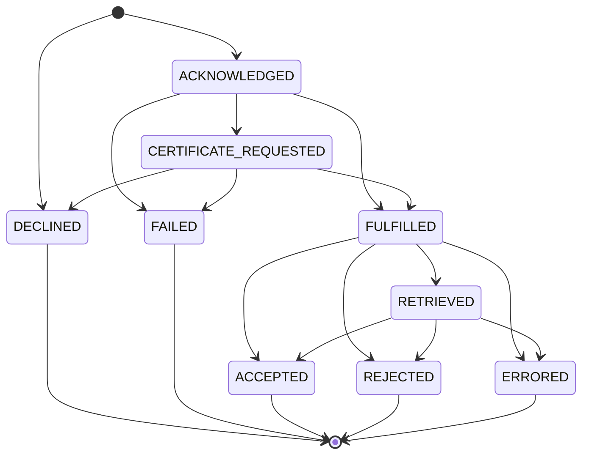
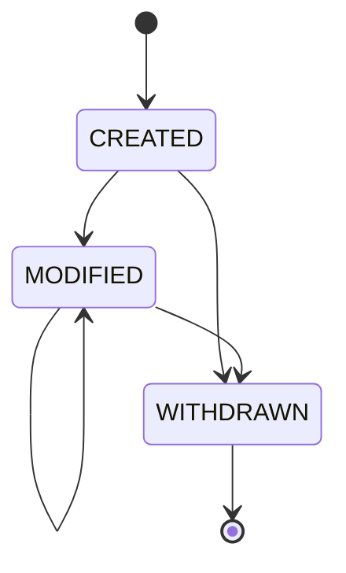
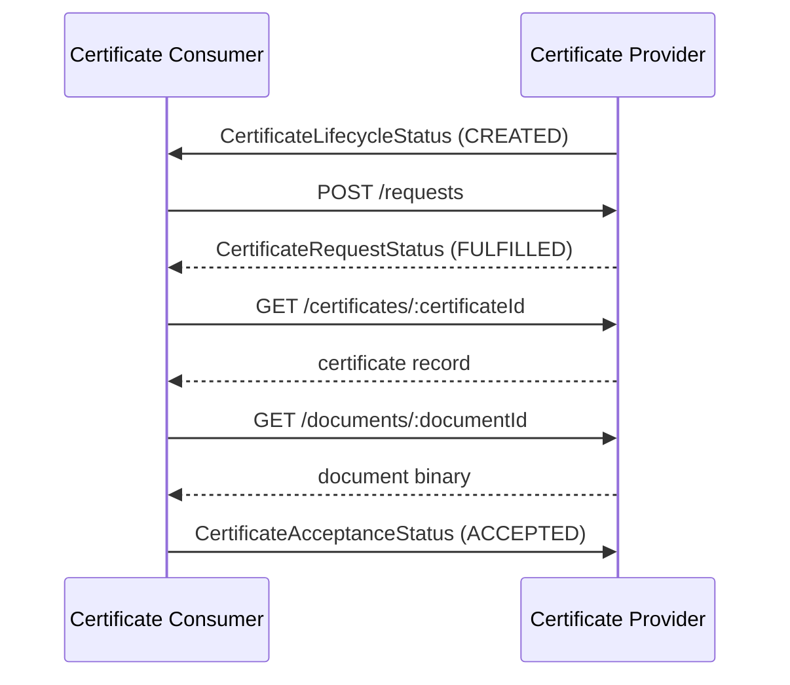
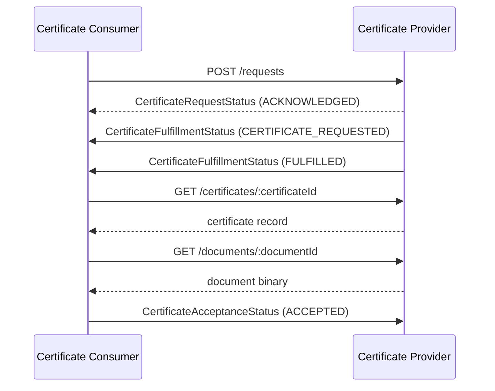

# Supply Chain Certificate Exchange

Supply Chain Certificate Exchange (SCE) defines an interoperable protocol for exchanging company certificates between
supply chain participants. It specifies the certificate exchange and certificate lifecycle state machines, the event
types that communicate their transitions, and the HTTP APIs used to request, deliver, retrieve, and search
certificates.

SCE is a [=Composing Specification=] of [Supply Chain Core Messaging](./core-messaging.md) [[sce-cm]]. All events
defined in this specification MUST conform to that specification.

## Terminology

The following terms are used to describe concepts in this specification. The terms [=Event=], [=Producer=],
[=Consumer=], and [=Participant=] are defined in [[sce-cm]].

- <dfn>Certificate</dfn>: A structured record attesting that one or more locations of a [=Participant=] hold a
  certification (for example, a quality management certification), together with the documents evidencing it.
- <dfn>Certificate Provider</dfn>: The [=Participant=] that holds and provides a [=Certificate=].
- <dfn>Certificate Consumer</dfn>: The [=Participant=] that requests, retrieves, and evaluates a [=Certificate=].
- <dfn>Certificate Exchange</dfn>: A single, correlatable interaction in which one [=Certificate=] is delivered from a
  [=Certificate Provider=] to a [=Certificate Consumer=] and its outcome is reported back.
- <dfn>Certificate Lifecycle</dfn>: The lifecycle of a [=Certificate=] as an artifact — its publication, revision, and
  withdrawal — independent of any [=Certificate Exchange=].
- <dfn>Document</dfn>: A file (typically binary, for example a PDF) evidencing a [=Certificate=] in human-readable
  form.
- <dfn>Revision</dfn>: A monotonically increasing version counter of a [=Certificate=] under a stable identifier.

## Conformance

The keywords MAY, MUST, MUST NOT, OPTIONAL, RECOMMENDED, REQUIRED, SHOULD, and SHOULD NOT in this document are to be
interpreted as described in BCP 14 [[rfc2119]] [[rfc8174]] when, and only when, they appear in all capitals, as shown
here.

A [=Participant=] MAY implement either or both of the APIs defined by this specification:

- The [Certificate Provider API](#certificate-provider-api) MUST be implemented in its entirety by a [=Participant=]
  that offers [=Certificates=].
- The [Certificate Consumer API](#certificate-consumer-api) is OPTIONAL and enables a [=Certificate Consumer=] to
  receive notifications and answer acceptance status queries.

An implementation MUST comply with the state machines, event definitions, and data model defined in this
specification.

## Base Concepts

### Certificate Exchange

A [=Certificate Exchange=] represents one end-to-end interaction between a [=Certificate Provider=] and a
[=Certificate Consumer=] involving the delivery of a single [=Certificate=], from the time the interaction is opened
until it reaches a terminal outcome.

#### Identity and Correlation

A [=Certificate Exchange=] is identified by an `exchangeId` assigned by the [=Certificate Provider=] when the exchange
is opened. The `exchangeId` is the correlation handle for the entire interaction and is distinct from the identifier
of any individual [=Event=] (`source` + `id`, see [[sce-cm]]).

An exchange concerns a specific [=Certificate=] version — a (`certificateId`, `revision`) pair — and is conducted with
a counterparty, the authenticated [=Certificate Consumer=].

A [=Certificate Exchange=] is opened only by the [=Certificate Consumer=], by submitting a certificate request (see
[Certificate Request](#certificate-request)). The [=Certificate Provider=] assigns the `exchangeId` and returns it in
the response. Every request opens an exchange — including one the provider declines, which opens an exchange that
terminates immediately at `DECLINED`; the `exchangeId` is still returned so the outcome remains correlatable.

Notifications never open an exchange. A certificate lifecycle event (see
[Certificate Lifecycle Events](#certificate-lifecycle-events)) is purely informational; a [=Certificate Consumer=]
that wants a correlated delivery of a [=Certificate=] it was notified about opens an exchange by submitting a
certificate request. A provider that already holds the [=Certificate=] can fulfill such a request immediately.

Each [=Certificate Exchange=] has a unique `exchangeId`. A message that repeats an `exchangeId` refers to the same
exchange rather than opening a new one. Multiple exchanges MAY concern the same [=Certificate=] and counterparty.

Acceptance feedback is correlated to the exchange by its `exchangeId`.

A re-attempt after a terminal outcome — for example, re-evaluating a `REJECTED` or `ERRORED` [=Certificate=] — is a
new [=Certificate Exchange=], with a new `exchangeId`, for the same [=Certificate=].

#### Phases and Ownership

A [=Certificate Exchange=] progresses through two sequential phases, each owned by one party:

1. **Fulfillment (provider-owned):** The [=Certificate Provider=] works to make the [=Certificate=] available.
2. **Acceptance (consumer-owned):** The [=Certificate Consumer=] retrieves and processes the [=Certificate=] and
   reports the outcome.

The phases never overlap: the Acceptance phase begins only once Fulfillment has made the [=Certificate=] available.
Provider-owned and consumer-owned states use deliberately disjoint vocabulary, so the owner of a state is unambiguous.
Each phase can end in a negative decision or a business error: `DECLINED`/`REJECTED` are decisions (the provider
declines the request, or the consumer does not accept the certificate), while `FAILED`/`ERRORED` indicate a business
error such as an invalid certificate. These states represent business-level problems only; technical and transport
failures (for example, connectivity errors or timeouts) are not modeled as [=Certificate Exchange=] states and are
handled at the transport layer.

#### Exchange State Machine

The states of a [=Certificate Exchange=] are defined below, which implementations MUST support:



| State                     | Phase       | Owner    | Terminal | Description                                                                                                     |
|---------------------------|-------------|----------|----------|------------------------------------------------------------------------------------------------------------------|
| `ACKNOWLEDGED`            | Fulfillment | Provider | No       | The provider accepted the request and began preparing the certificate.                                          |
| `CERTIFICATE_REQUESTED` | Fulfillment | Provider | No       | The provider submitted the request to an external certification authority and is awaiting issuance. *(Optional)* |
| `FULFILLED`               | Fulfillment | Provider | No       | The certificate is prepared and available for retrieval. Hand-off point.                                        |
| `DECLINED`                | Fulfillment | Provider | Yes      | The provider declined the request (a business decision; e.g., the certificate type is not offered).             |
| `FAILED`                  | Fulfillment | Provider | Yes      | The provider could not produce a valid certificate (a business error; e.g., the certificate is invalid).        |
| `RETRIEVED`               | Acceptance  | Consumer | No       | The consumer fetched the certificate and is processing it. *(Optional — see below.)*                            |
| `ACCEPTED`                | Acceptance  | Consumer | Yes      | The consumer accepted the certificate.                                                                          |
| `REJECTED`                | Acceptance  | Consumer | Yes      | The consumer did not accept the certificate content (a business decision).                                      |
| `ERRORED`                 | Acceptance  | Consumer | Yes      | The consumer found the certificate to be in error (a business error; e.g., the certificate is invalid).         |

The first Fulfillment status a [=Certificate Consumer=] observes is the one carried in the request response (see
[Certificate Request](#certificate-request)). A provider that can satisfy a request without intermediate steps MAY
report a later Fulfillment state directly — for example `FULFILLED` when the certificate is already held, or
`CERTIFICATE_REQUESTED` when the request is immediately forwarded to an external authority — having passed through
the earlier states instantly. A reported `status` therefore reflects the exchange's current state, not necessarily a
single transition from the state before it.

#### Acceptance Feedback

All acceptance feedback is OPTIONAL. `RETRIEVED` is a non-terminal acknowledgment that the [=Certificate Consumer=]
has fetched the [=Certificate=] and is evaluating it; the consumer MAY report it as a delivery receipt but is not
required to. An exchange therefore reaches a terminal acceptance state either by way of `RETRIEVED`
(`FULFILLED → RETRIEVED → {ACCEPTED, REJECTED, ERRORED}`) or directly from `FULFILLED`
(`FULFILLED → {ACCEPTED, REJECTED, ERRORED}`). If the consumer never provides feedback, the exchange remains in
`FULFILLED` indefinitely.

#### Terminal States and Immutability

A [=Certificate Exchange=] is single-shot. The five terminal states — `DECLINED`, `FAILED`, `ACCEPTED`, `REJECTED`,
and `ERRORED` — conclude the exchange permanently. A terminal exchange MUST NOT be reopened, reused, or transitioned
further.

#### Relationship to the Certificate Lifecycle

A [=Certificate Exchange=] governs the *delivery* of a [=Certificate=], not the certificate itself. Modifications and
withdrawals of a certificate are changes to the certificate artifact and are not transitions of a
[=Certificate Exchange=]. A change to a certificate that has already been delivered does not reopen or alter the
(possibly terminal) exchange that delivered it.

### Certificate Lifecycle

The [=Certificate Lifecycle=] tracks a [=Certificate=] as an artifact over time, independently of how many times it is
delivered. Whereas a [=Certificate Exchange=] is single-shot and concerns one delivery interaction, a certificate is
long-lived: it may be published, revised, and eventually withdrawn.

#### Identity and Versioning

A [=Certificate=] is identified by a `certificateId` that is stable for the life of the certificate. A modification
does not create a new identifier; instead, the certificate is versioned by a [=Revision=] counter:

- `CREATED` makes the first `revision` of the certificate available for retrieval.
- Each `MODIFIED` publishes a new `revision` under the same `certificateId`, superseding the previous one. The latest
  `revision` is authoritative.
- A certificate version is therefore identified by the pair (`certificateId`, `revision`). A [=Certificate Exchange=]
  delivers one specific version.

The `revision` is a positive integer with an initial value of `1` that MUST be incremented by `1` for every update of
the certificate record, including changes that do not alter the certified content (for example, a correction to the
record's metadata).

The `certificateId` and initial `revision` MAY be assigned before the certificate is published: when a
[=Certificate Provider=] accepts a request and produces the certificate later, the identifier is allocated at
acceptance so that an in-progress [=Certificate Exchange=] can reference its certificate. Publication (`CREATED`)
occurs when the certificate becomes available.

#### Lifecycle State Machine

The lifecycle states describe the *publication* lifecycle of the [=Certificate=], which implementations MUST support.
They are independent of the certificate's validity (see [Validity](#validity-as-a-separate-dimension)).



| State       | Terminal | Description                                                                                                                 |
|-------------|----------|-----------------------------------------------------------------------------------------------------------------------------|
| `CREATED`   | No       | The certificate was first published under a new `certificateId`, establishing its initial version.                          |
| `MODIFIED`  | No       | A new `revision` of the certificate was published under the same `certificateId`; the `revision` is incremented. May recur. |
| `WITHDRAWN` | Yes      | The provider withdrew (removed) the certificate; it is no longer available. Terminal.                                       |

#### Validity as a Separate Dimension

A [=Certificate=]'s validity is an independent dimension derived from its `validFrom` and `validUntil` dates, not from
the publication states defined above. A given `revision` is *active* within its validity window and *expired*
afterward; this status changes with the passage of time alone — no lifecycle transition occurs. The two dimensions are
orthogonal: a certificate MAY be `WITHDRAWN` while still within its validity window, or remain `CREATED`/`MODIFIED`
after it has expired.

#### Relationship to the Certificate Exchange

Lifecycle transitions are communicated to [=Certificate Consumers=] as certificate lifecycle events (see
[Certificate Lifecycle Events](#certificate-lifecycle-events)). These events are purely informational: no lifecycle
event opens, alters, or closes a [=Certificate Exchange=]. A `MODIFIED` revises the certificate in place under the
same `certificateId` without initiating a new delivery, and a `WITHDRAWN` ends the certificate's availability.

## Protocol Events

All events defined by this specification MUST conform to [[sce-cm]], including its HTTPS binding and batch rules. The
following event types are defined:

| Event Type                                     | Direction           | Purpose                                                              |
|------------------------------------------------|---------------------|----------------------------------------------------------------------|
| `org.dsaf.sce.CertificateLifecycleStatus.v1`   | Provider → Consumer | Communicates a [=Certificate Lifecycle=] transition                  |
| `org.dsaf.sce.CertificateFulfillmentStatus.v1` | Provider → Consumer | Communicates the Fulfillment-phase status of a [=Certificate Exchange=] |
| `org.dsaf.sce.CertificateAcceptanceStatus.v1`  | Consumer → Provider | Communicates the Acceptance-phase status of a [=Certificate Exchange=]  |

### Certificate Lifecycle Status Event

A `CertificateLifecycleStatus` event communicates a transition of the [=Certificate Lifecycle=] state machine. It is a
pure notification: it MUST NOT open a [=Certificate Exchange=] and MUST NOT carry [=Document=] content.

The `data` payload has the following structure:

|              |                                                                                                                        |
|--------------|--------------------------------------------------------------------------------------------------------------------------|
| **Schema**   | [JSON Schema](./schemas/certificate.lifecycle.status.event.schema.json)                                                   |
| **Required** | - `status`: One of `CREATED`, `MODIFIED`, `WITHDRAWN`.                                                                 |
|              | - `certificate`: A summary of the certificate record (see below).                                                      |

For `CREATED` and `MODIFIED`, the `certificate` object MUST contain exactly the following summary fields, which let a
consumer triage relevance without retrieving the certificate: `certificateId`, `revision`, `certificateType`,
`validFrom`, and `validUntil`. The provider MUST NOT include any other certificate fields — in particular not
`certifiedLocations` or `documents`.

For `WITHDRAWN`, the `certificate` object MUST contain only `certificateId`.

The `subject` attribute of the event SHOULD be set to the `certificateId`.

The following is a non-normative example of a `CREATED` notification:

```json
{
  "specversion": "1.0",
  "type": "org.dsaf.sce.CertificateLifecycleStatus.v1",
  "source": "did:web:provider.example.com",
  "id": "a1b2c3d4-5e6f-7a8b-9c0d-1e2f3a4b5c6d",
  "subject": "550e8400-e29b-41d4-a716-446655440000",
  "time": "2026-05-04T07:00:00Z",
  "datacontenttype": "application/json",
  "data": {
    "status": "CREATED",
    "certificate": {
      "certificateId": "550e8400-e29b-41d4-a716-446655440000",
      "revision": 1,
      "certificateType": "iso9001",
      "validFrom": "2026-01-25",
      "validUntil": "2029-01-24"
    }
  }
}
```

### Certificate Fulfillment Status Event

A `CertificateFulfillmentStatus` event reports the Fulfillment-phase status of a [=Certificate Exchange=] to the
[=Certificate Consumer=] that opened it. It never carries a certificate record.

The `data` payload has the following structure:

|              |                                                                                                                            |
|--------------|------------------------------------------------------------------------------------------------------------------------------|
| **Schema**   | [JSON Schema](./schemas/certificate.fulfillment.status.event.schema.json)                                                     |
| **Required** | - `exchangeId`: The identifier of the [=Certificate Exchange=].                                                            |
|              | - `status`: One of `ACKNOWLEDGED`, `CERTIFICATE_REQUESTED`, `FULFILLED`, `DECLINED`, `FAILED`.                           |
| **Optional** | - `certificateId`, `revision`: The certificate version the exchange concerns. MUST be present when `status` is `FULFILLED`. |
|              | - `errors`: An array of [error objects](#error-object). MUST be present and non-empty when `status` is `DECLINED` or `FAILED`. |

The following is a non-normative example of a `FULFILLED` notification:

```json
{
  "specversion": "1.0",
  "type": "org.dsaf.sce.CertificateFulfillmentStatus.v1",
  "source": "did:web:provider.example.com",
  "id": "f0e1d2c3-b4a5-6789-0abc-def012345678",
  "time": "2026-05-04T07:30:00Z",
  "datacontenttype": "application/json",
  "data": {
    "exchangeId": "7f3a9c12-4b8e-4d6a-9e21-0c5b2a1d8f44",
    "certificateId": "550e8400-e29b-41d4-a716-446655440000",
    "revision": 1,
    "status": "FULFILLED"
  }
}
```

### Certificate Acceptance Status Event

A `CertificateAcceptanceStatus` event reports the Acceptance-phase status of a [=Certificate Exchange=] to the
[=Certificate Provider=]. The event is correlated to its exchange by the `exchangeId`.

The `data` payload has the following structure:

|              |                                                                                                                                    |
|--------------|----------------------------------------------------------------------------------------------------------------------------------------|
| **Schema**   | [JSON Schema](./schemas/certificate.acceptance.status.event.schema.json)                                                              |
| **Required** | - `exchangeId`: The identifier of the [=Certificate Exchange=] the status applies to.                                              |
|              | - `status`: One of `RETRIEVED`, `ACCEPTED`, `REJECTED`, `ERRORED`.                                                                 |
| **Optional** | - `certificateId`, `revision`: The certificate version the status applies to.                                                      |
|              | - `errors`: An array of [error objects](#error-object). MUST be present and non-empty when `status` is `REJECTED` or `ERRORED`; MUST NOT be present otherwise. |

The following is a non-normative example of a `REJECTED` acceptance status event:

```json
{
  "specversion": "1.0",
  "type": "org.dsaf.sce.CertificateAcceptanceStatus.v1",
  "source": "did:web:consumer.example.com",
  "id": "f1a2b3c4-d5e6-7f8a-9b0c-1d2e3f4a5b6c",
  "time": "2026-05-04T09:00:00Z",
  "datacontenttype": "application/json",
  "data": {
    "exchangeId": "7f3a9c12-4b8e-4d6a-9e21-0c5b2a1d8f44",
    "certificateId": "550e8400-e29b-41d4-a716-446655440000",
    "revision": 1,
    "status": "REJECTED",
    "errors": [
      {
        "message": "Certificate has expired"
      },
      {
        "specifier": "site-0021",
        "message": "Site site-0021 was rejected"
      }
    ]
  }
}
```

### Error Object

An error object has the following structure:

|              |                                                                                                                                       |
|--------------|-------------------------------------------------------------------------------------------------------------------------------------------|
| **Required** | - `message`: A human-readable description of the error.                                                                               |
| **Optional** | - `specifier`: An identifier scoping the error to a particular element of the certificate, for example a certified location identifier. If omitted, the error applies to the certificate as a whole. |

## Protocol Flows

*This section is non-normative.*

The following sequence diagrams illustrate typical [=Certificate Exchange=] interactions. HTTP requests are shown
with solid lines and their responses with dashed lines.

### Notification-Initiated Flow

The [=Certificate Provider=] publishes a new [=Certificate=] and notifies the [=Certificate Consumer=] with a
`CREATED` lifecycle event. The notification is purely informational; the consumer opens a [=Certificate Exchange=] by
submitting a certificate request, which the provider — already holding the certificate — fulfills immediately in the
request response. The consumer then retrieves the certificate and reports acceptance:



### Request-Initiated Flow

The [=Certificate Consumer=] requests a [=Certificate=] the [=Certificate Provider=] does not yet hold. The provider
acknowledges the request and reports Fulfillment progress with fulfillment status events — here including the
OPTIONAL `CERTIFICATE_REQUESTED` state while an external certification authority issues the certificate. Once
`FULFILLED`, the consumer retrieves the certificate and reports acceptance:



A [=Certificate Consumer=] that does not expose the [Certificate Consumer API](#certificate-consumer-api) observes
Fulfillment progress by polling [Certificate Request Status](#certificate-request-status) instead of receiving
fulfillment status events.

## Certificate Consumer API

> OpenAPI specification: [certificate.consumer.api.yaml](./certificate.consumer.api.yaml)

The Certificate Consumer API enables a [=Certificate Consumer=] to receive notifications from [=Certificate
Providers=] and to answer acceptance status queries. The API is OPTIONAL; a consumer that does not wish to receive
notifications or answer acceptance status queries is not required to implement it.

A [=Certificate Consumer=] that implements the API MUST serve all specified endpoints but MAY return
`HTTP 501 Not Implemented` for endpoints it does not wish to support. For example, a consumer that wants to receive
notifications but does not want to answer acceptance status queries MAY return `HTTP 501` for the acceptance status
endpoint.

A [=Certificate Provider=] MUST push notifications as defined in this section to every [=Certificate Consumer=] whose
Consumer API endpoint it knows. This obligation applies only to the endpoints the consumer actually serves: if the
consumer returns `HTTP 501` for an endpoint, the provider is relieved of the obligation to push to that endpoint.
Polling ([Certificate Request Status](#certificate-request-status)) remains available as a fallback and is not a
substitute for the push obligation. How a provider discovers a consumer's endpoint is out of scope of this
specification.

### Base URL

All endpoint URLs in this specification are relative. The base URL MUST use the HTTPS scheme. The base URL is
implementation-specific and may include additional context information such as a sub-path that indicates a version.

### Notifications

The `notifications` endpoint accepts certificate lifecycle and fulfillment status events. The request body is a
single [=Event=] or a batch (a JSON array) as defined by [[sce-cm]].

A [=Certificate Provider=] MUST push:

- a `CertificateLifecycleStatus` event for every [=Certificate Lifecycle=] transition (`CREATED`, `MODIFIED`,
  `WITHDRAWN`) of a certificate the consumer is entitled to, and
- a `CertificateFulfillmentStatus` event when an exchange opened by the consumer reaches `FULFILLED`, `DECLINED`, or
  `FAILED`.

A provider MAY additionally push `CertificateFulfillmentStatus` events for intermediate Fulfillment states
(`ACKNOWLEDGED`, `CERTIFICATE_REQUESTED`).

|                 |                                                                                                                                            |
|-----------------|--------------------------------------------------------------------------------------------------------------------------------------------|
| **HTTP Method** | `POST`                                                                                                                                     |
| **URL Path**    | `/notifications`                                                                                                                           |
| **Request**     | A [`CertificateLifecycleStatus`](#certificate-lifecycle-status-event) or [`CertificateFulfillmentStatus`](#certificate-fulfillment-status-event) event, or a batch |
| **Response**    | `HTTP 204` OR `HTTP 4xx Client Error`                                                                                                      |

### Acceptance Status Query

The `acceptance-status` endpoint allows a [=Certificate Provider=] to query the current Acceptance-phase status of a
[=Certificate Exchange=]. It is the pull counterpart of the
[`CertificateAcceptanceStatus`](#certificate-acceptance-status-event) event.

If the `exchangeId` is unknown to the consumer, it MUST respond with `HTTP 404 Not Found`.

|                 |                                                                                                        |
|-----------------|----------------------------------------------------------------------------------------------------------|
| **HTTP Method** | `GET`                                                                                                  |
| **URL Path**    | `/acceptance-status/:exchangeId`                                                                       |
| **Response**    | `HTTP 200` with the [`CertificateAcceptanceStatus` data payload](#certificate-acceptance-status-event) OR `HTTP 4xx Client Error` OR `HTTP 501` |

## Certificate Provider API

> OpenAPI specification: [certificate.provider.api.yaml](./certificate.provider.api.yaml)

The Certificate Provider API enables [=Certificate Providers=] to accept certificate requests, report fulfillment
status, serve certificate data, answer search queries, and receive acceptance status events. A [=Certificate
Provider=] MUST implement all endpoints in this section.

### Certificate Request

The `requests` endpoint opens a [=Certificate Exchange=]. The request identifies the certificate type sought and
optionally the certified locations the request targets.

The request body has the following structure:

|              |                                                                                                                                |
|--------------|------------------------------------------------------------------------------------------------------------------------------------|
| **Schema**   | [JSON Schema](./schemas/certificate.request.schema.json)                                                                        |
| **Required** | - `certificateType`: The [certificate type](#certificate-type) requested.                                                      |
| **Optional** | - `certifiedLocations`: An array of location objects the request targets. Each object MAY contain any of the properties `legalEntityId`, `siteId`, and `addressId` of a [certified location](#certified-locations), and MUST contain at least one. If the array is omitted, the request applies to the requesting party's counterparty as a whole. |

The response carries the assigned `exchangeId` and the current exchange `status` as a
[Certificate Request Status](#certificate-request-status-object) object (see
[Exchange State Machine](#exchange-state-machine)).

|                 |                                                                                     |
|-----------------|---------------------------------------------------------------------------------------|
| **HTTP Method** | `POST`                                                                              |
| **URL Path**    | `/requests`                                                                         |
| **Request**     | The request body defined above                                                      |
| **Response**    | `HTTP 200` with a [`CertificateRequestStatus`](#certificate-request-status-object) OR `HTTP 4xx Client Error` |

The following is a non-normative example of a request body:

```json
{
  "certificateType": "iso9001",
  "certifiedLocations": [
    {
      "legalEntityId": "PRT000000001234",
      "siteId": "site-0021"
    }
  ]
}
```

### Certificate Request Status

The `requests` status endpoint allows a [=Certificate Consumer=] to poll the Fulfillment-phase status of an exchange
it opened. It reports only the Fulfillment phase; the consumer's acceptance outcome is reported separately via the
provider's [Acceptance Notifications](#acceptance-notifications) endpoint. When the provider pushes fulfillment
events to the consumer, this endpoint serves as a fallback and recovery mechanism and MUST report the same `status`
as the pushed events.

If the `exchangeId` is unknown, the provider MUST respond with `HTTP 404 Not Found`.

|                 |                                                                                     |
|-----------------|---------------------------------------------------------------------------------------|
| **HTTP Method** | `GET`                                                                               |
| **URL Path**    | `/requests/:exchangeId`                                                             |
| **Response**    | `HTTP 200` with a [`CertificateRequestStatus`](#certificate-request-status-object) OR `HTTP 4xx Client Error` |

#### Certificate Request Status Object

|              |                                                                                                                                |
|--------------|------------------------------------------------------------------------------------------------------------------------------------|
| **Schema**   | [JSON Schema](./schemas/certificate.request.status.schema.json)                                                                  |
| **Required** | - `exchangeId`: The identifier assigned to the [=Certificate Exchange=].                                                       |
|              | - `status`: One of `ACKNOWLEDGED`, `CERTIFICATE_REQUESTED`, `FULFILLED`, `DECLINED`, `FAILED`.                               |
| **Optional** | - `certificateId`, `revision`: The certificate version the exchange concerns, once assigned. MUST be present when `status` is `FULFILLED`. |
|              | - `errors`: An array of [error objects](#error-object). MUST be present and non-empty when `status` is `DECLINED` or `FAILED`. |

The following is a non-normative example:

```json
{
  "exchangeId": "7f3a9c12-4b8e-4d6a-9e21-0c5b2a1d8f44",
  "certificateId": "550e8400-e29b-41d4-a716-446655440000",
  "revision": 1,
  "status": "FULFILLED"
}
```

### Certificate Retrieval

The `certificates` endpoint returns a certificate record conforming to the
[certificate data model](#certificate-data-model). By default the latest [=Revision=] is returned; the `revision`
query parameter selects a specific one.

The response includes [=Document=] references only and MUST NOT include document content. Document content is
retrieved separately (see [Document Retrieval](#document-retrieval)).

A withdrawn certificate (lifecycle state `WITHDRAWN`) need not remain retrievable: the provider MAY cease returning
the certificate record and its documents. The provider MUST, however, retain the fact that the certificate was
withdrawn and make it observable — for a withdrawn `certificateId`, the endpoint MUST return `HTTP 200` with the
minimal status body `{ "certificateId": "…", "status": "WITHDRAWN" }` (no metadata or documents). An unknown
`certificateId` returns `HTTP 404 Not Found`.

|                 |                                                                                            |
|-----------------|----------------------------------------------------------------------------------------------|
| **HTTP Method** | `GET`                                                                                      |
| **URL Path**    | `/certificates/:certificateId`                                                             |
| **Query**       | `revision` *(optional)*: a specific revision to retrieve; the latest is returned if omitted |
| **Response**    | `HTTP 200` with a [certificate record](#certificate-data-model) OR `HTTP 4xx Client Error` |

### Document Retrieval

The `documents` endpoint returns the binary content of a [=Document=] referenced by a certificate record. The
response `Content-Type` MUST be the document's `mediaType`.

|                 |                                                                       |
|-----------------|-------------------------------------------------------------------------|
| **HTTP Method** | `GET`                                                                 |
| **URL Path**    | `/documents/:documentId`                                              |
| **Response**    | `HTTP 200` with the document binary OR `HTTP 4xx Client Error`        |

### Acceptance Notifications

The `notifications` endpoint accepts [`CertificateAcceptanceStatus`](#certificate-acceptance-status-event) events by
which a [=Certificate Consumer=] reports acceptance feedback for an exchange. The request body is a single [=Event=]
or a batch (a JSON array) as defined by [[sce-cm]].

The event is correlated to its [=Certificate Exchange=] by `data.exchangeId`. An event referencing an unknown
`exchangeId` MUST be rejected with `HTTP 404 Not Found`. An event reporting a transition that is invalid for the
exchange's current state (see [Exchange State Machine](#exchange-state-machine)) MUST be rejected with
`HTTP 409 Conflict`.

|                 |                                                                                                  |
|-----------------|----------------------------------------------------------------------------------------------------|
| **HTTP Method** | `POST`                                                                                           |
| **URL Path**    | `/notifications`                                                                                 |
| **Request**     | A [`CertificateAcceptanceStatus`](#certificate-acceptance-status-event) event, or a batch        |
| **Response**    | `HTTP 204` OR `HTTP 4xx Client Error`                                                            |

### Certificate Search

The `search` endpoint returns certificate records matching the supplied criteria. The request body is a single JSON
object whose properties are filters; a certificate matches only if it satisfies every supplied filter (logical AND).
An empty object matches all certificates visible to the caller.

The following filters MUST be supported:

|              |                                                                                                                                     |
|--------------|-----------------------------------------------------------------------------------------------------------------------------------------|
| **Schema**   | [JSON Schema](./schemas/certificate.search.request.schema.json) (response: [JSON Schema](./schemas/certificate.search.response.schema.json)) |
| **Optional** | - `certificateId`: Matches the certificate with this identifier.                                                                    |
|              | - `certificateType`: Matches certificates of this [certificate type](#certificate-type).                                            |
|              | - `certifiedLocations`: An array of location filter objects (see below).                                                            |

A location filter object MAY contain any of the properties `legalEntityId`, `siteId`, and `addressId`, and MUST
contain at least one. A [certified location](#certified-locations) entry matches a location filter object only if it
satisfies every property the object supplies (logical AND, compared for equality). A certificate matches the
`certifiedLocations` filter only if, for every location filter object, at least one of its certified location entries
matches that object (logical AND across the array).

A provider MAY support additional filter properties. A search using a filter property the provider does not support
MUST be rejected with `HTTP 400 Bad Request`.

Each result entry carries the full certificate metadata for the latest [=Revision=], conforming to the
[certificate data model](#certificate-data-model), without document content.

Results MAY be paginated. The `limit` query parameter bounds the page size. When a response is not the last page, it
MUST carry a non-empty `cursor` property; the client passes the value back via the `cursor` query parameter to fetch
the next page. The `cursor` value is opaque to the client.

|                 |                                                                                                       |
|-----------------|---------------------------------------------------------------------------------------------------------|
| **HTTP Method** | `POST`                                                                                                |
| **URL Path**    | `/search`                                                                                             |
| **Query**       | `limit` *(optional)*: maximum number of results per page; `cursor` *(optional)*: opaque page cursor   |
| **Request**     | The filter object defined above                                                                       |
| **Response**    | `HTTP 200` with `{ "result": [ … ], "cursor": "…" }` OR `HTTP 4xx Client Error`                       |

The following is a non-normative example of a search request and response:

```json
{
  "certificateType": "iso14001",
  "certifiedLocations": [
    {
      "legalEntityId": "PRT000000001234",
      "siteId": "site-0021"
    }
  ]
}
```

```json
{
  "result": [
    {
      "certificateId": "550e8400-e29b-41d4-a716-446655440000",
      "revision": 1,
      "certificateType": "iso14001",
      "certificateTypeVersion": "2015",
      "registrationNumber": "12 100 4711",
      "validFrom": "2026-01-25",
      "validUntil": "2029-01-24",
      "certifiedLocations": [
        {
          "legalEntityId": "PRT000000001234",
          "siteId": "site-0021",
          "locationRole": "MAIN_LOCATION"
        }
      ],
      "issuer": {
        "issuerName": "Example Certification Body",
        "issuerId": "PRT000000009876"
      },
      "documents": [
        {
          "documentId": "3fa85f64-5717-4562-b3fc-2c963f66afa6",
          "createdDate": "2026-01-25",
          "language": "en",
          "mediaType": "application/pdf"
        }
      ]
    }
  ]
}
```

## Certificate Data Model

A certificate record exchanged under this specification MUST conform to the following data model.

### Certificate Record

|              |                                                                                                                        |
|--------------|----------------------------------------------------------------------------------------------------------------------------|
| **Schema**   | [JSON Schema](./schemas/certificate.schema.json)                                                                       |
| **Required** | - `certificateId`: Unique identifier of the certificate. MUST be a UUID [[rfc9562]].                                   |
|              | - `revision`: Positive integer identifying the certificate version (see [Identity and Versioning](#identity-and-versioning)). |
|              | - `certificateType`: The [certificate type](#certificate-type).                                                        |
|              | - `validFrom`: Inclusive validity start date.                                                                          |
|              | - `validUntil`: Inclusive validity end date.                                                                           |
|              | - `certifiedLocations`: An array of [certified location](#certified-locations) entries.                                |
|              | - `issuer`: The issuing party: `issuerName` (required) and `issuerId`, its [=Participant=] or dataspace identifier (optional). |
|              | - `documents`: An array of [document references](#documents).                                                          |
| **Optional** | - `certificateTypeVersion`: Edition of the certificate type (for example, `2015`).                                     |
|              | - `registrationNumber`: The issuing authority's registration number for the certificate.                               |
|              | - `areaOfApplication`: The overall scope statement of the certificate, verbatim, when not scoped per location.         |
|              | - `validator`: The validating party, when distinct from the issuer: `validatorName` (required) and `validatorId` (optional). |

### Certificate Type

The `certificateType` is an opaque string code identifying the type of certification (for example, `iso9001`,
`iso14001`, `iatf16949`). Type codes MUST follow these spelling rules:

1. Only Latin letters and digits are allowed.
2. All letters are lowercase.
3. No whitespace, underscores, or other special characters are allowed.

The set of certificate types is open; deployments define which types they support.

### Certified Locations

Each entry of `certifiedLocations` represents exactly one certified location as stated on the certificate document.
An entry has the following structure:

|              |                                                                                                                            |
|--------------|--------------------------------------------------------------------------------------------------------------------------------|
| **Required** | - `legalEntityId`: Identifier of the legal entity the location belongs to. For the `MAIN_LOCATION` entry this is also the certificate holder. |
|              | - `locationRole`: One of `MAIN_LOCATION`, `ENCLOSED_LOCATION`, `REMOTE_SUPPORT_LOCATION`, `EXTENDED_MANUFACTURING_SITE`.  |
| **Optional** | - `siteId`: Identifier of the certified site, when applicable.                                                             |
|              | - `addressId`: Identifier of the certified address, when applicable.                                                       |
|              | - `areaOfApplication`: Location-specific scope, verbatim, only if explicitly stated on the certificate or its annex.       |

Location identifiers are dataspace-scoped identifiers; their format is defined by the deployment context.

The following rules apply:

1. Exactly one entry MUST have `locationRole` = `MAIN_LOCATION`.
2. The certificate holder is derived as the `legalEntityId` of the `MAIN_LOCATION` entry.
3. A per-location `areaOfApplication` MUST be set only if a location-specific scope is explicitly stated on the
   certificate or its annex; otherwise it MUST be absent. Every printed scope statement MUST appear exactly once in
   the record.
4. Interpretation logic (scope inheritance to subordinate locations, hierarchy expansion) is out of scope of this
   specification and left to the [=Certificate Consumer=].

### Documents

Each entry of `documents` is a reference to a [=Document=] and MUST NOT carry document content. An entry has the
following structure:

|              |                                                                                                          |
|--------------|--------------------------------------------------------------------------------------------------------------|
| **Required** | - `documentId`: Unique, revision-independent identifier of the document, resolvable via [Document Retrieval](#document-retrieval). It is RECOMMENDED to use a UUID. |
|              | - `mediaType`: Media type of the document binary (for example, `application/pdf`) [[rfc2046]].           |
| **Optional** | - `createdDate`: Date the document was created.                                                          |
|              | - `language`: Primary language of the document as an [[iso639-1]] two-letter code (for example, `en`).   |

Multiple documents support certificates that consist of several files, for example different language versions.

## Security and Authorization

All endpoints MUST use HTTPS, that is, HTTP over TLS 1.2 or higher. Authorization mechanisms, including token formats
and acquisition, are defined by deployment profiles of this specification, consistent with [[sce-cm]].

**Sender identity.** Every event carries the asserting party's identity in its `source` attribute (see [[sce-cm]]).
The recipient MUST verify that `source` matches the authenticated identity of the sender and MUST reject the event
when they do not match:

- A [=Certificate Consumer=] MUST reject a lifecycle or fulfillment status event whose `source` does not match the
  authenticated [=Certificate Provider=].
- A [=Certificate Provider=] MUST reject an acceptance status event whose `source` does not match the authenticated
  [=Certificate Consumer=] of the referenced exchange.

**Document confidentiality.** [=Certificates=] and [=Documents=] are confidential. Certificate records and document
binaries MUST be served only over the authenticated channel and only to counterparties authorized for them.

If a client is not authorized for an endpoint request, the endpoint MUST return `401 Unauthorized` or
`404 Not Found`.

## References

*Note: when this document is converted to ReSpec, inline `[[citation]]` references will be resolved automatically via
SpecRef, and this section will be generated.*

### Normative References

<a id="sce-cm"></a>
**[sce-cm]** "Supply Chain Core Messaging", [core-messaging.md](./core-messaging.md).

<a id="iso639-1"></a>
**[iso639-1]** International Organization for Standardization, "ISO 639-1:2002, Codes for the representation of names
of languages — Part 1: Alpha-2 code", <https://www.iso.org/standard/22109.html>.

<a id="rfc2046"></a>
**[rfc2046]** Freed, N. and Borenstein, N., "Multipurpose Internet Mail Extensions (MIME) Part Two: Media Types",
RFC 2046, November 1996, <https://www.rfc-editor.org/rfc/rfc2046>.

<a id="rfc2119"></a>
**[rfc2119]** Bradner, S., "Key words for use in RFCs to Indicate Requirement Levels", BCP 14, RFC 2119, March 1997,
<https://www.rfc-editor.org/rfc/rfc2119>.

<a id="rfc8174"></a>
**[rfc8174]** Leiba, B., "Ambiguity of Uppercase vs Lowercase in RFC 2119 Key Words", BCP 14, RFC 8174, May 2017,
<https://www.rfc-editor.org/rfc/rfc8174>.

<a id="rfc9562"></a>
**[rfc9562]** Davis, K., Peabody, B., and Leach, P., "Universally Unique IDentifiers (UUIDs)", RFC 9562, May 2024,
<https://www.rfc-editor.org/rfc/rfc9562>.
